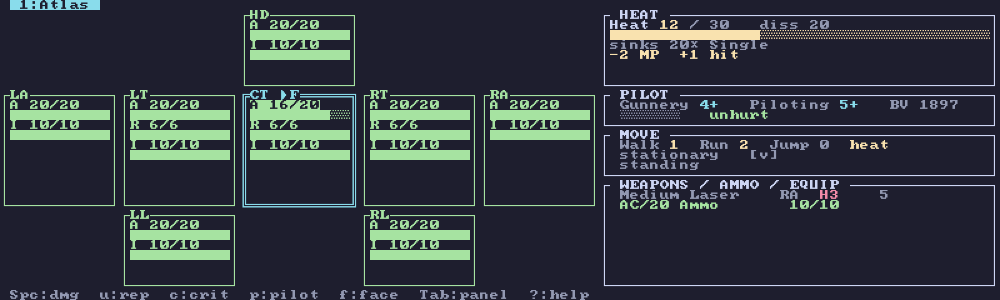

# Neurohelmet

A keyboard-driven [ratatui](https://ratatui.rs) BattleTech tracker — a terminal "paper doll" for
running a game from one screen. Sized for a 7" Raspberry Pi display (~100×30 cells) but at home in
any terminal, and **fully offline**: the entire unit catalog is baked into the binary, so the app
never touches the network at runtime.

Neurohelmet tracks **six BattleTech game systems**, each a first-class mode with live state (damage,
heat, ammo, crits, pilots, morale, fatigue) — you roll the dice and mark results, the app keeps the
sheet and surfaces the consequences.



📖 **Documentation:** the [Neurohelmet guide](docs/guide/src/introduction.md) covers install, the six
systems, sessions, the game log & publishing, and configuration. (Source under `docs/guide/`; rendered
to a browsable site via GitHub Pages.)

## The six systems it tracks

| System | Scale | What it is |
|--------|-------|-----------|
| **Classic** (Total Warfare) | one 'Mech / vehicle / squad | Full record sheet: armor / rear-armor / internal by location with inward cascade, the standard heat scale, ammo, **critical-slot** tables with consequences, the MechWarrior condition monitor, GATOR to-hit and movement/PSR helpers. Biped, **quad**, and **tripod** 'Mechs; combat vehicles (with motive damage); conventional infantry and Battle Armor; aerospace fighters (armor arcs + structural integrity). |
| **Alpha Strike** | one element | The fast-play card game: armor/structure pips, damage by range band, a 0–4 heat dial, overheat, the four crit types, special abilities — four cards to a screen. Optional 1:1 ground (hex) scale. |
| **Override** | one unit | [**BattleTech: Override**](https://dfawargaming.com) — DFA Wargaming's streamlined fan ruleset. Any catalog unit is converted to an Override card (pip armor/structure, a 0–5 heat ladder, TIC weapon groups, a condition monitor) and tracked live. |
| **Standard BattleForce** (IO:BF) | a company of lances | Per-element AS-card tracking at hex scale, grouped into lance-Units, with the BF critical-hit table and manual morale. |
| **Strategic BattleForce** (IO:BF) | formations | The AS-element roster grouped into Units (1–6 elements) and Formations, tracked at unit scale — spillover damage, the crit table, to-hit, and manual morale. |
| **Abstract Combat System** (IO:BF) | planetary invasion | The multi-regiment scale: elements fuse up through Combat Units into Formations, tracked as armor pools with damage thresholds, fatigue, and morale (ground-only v1). |

Each session is locked to one system when you create it; you can keep many named sessions side by
side. From Classic or Alpha Strike you can also peek at any unit's **Override** card on the fly with
`O`, without starting an Override session.

## Shared across every mode

- A fuzzy unit **picker** with a stat **preview** (BV / PV / C-bill cost), faceted **filters**
  (type, class, era, year) and a rarity/availability **lens** by faction and era.
- A **random force generator** (faction · era · size · point budget · rarity bias).
- **Force point budgets** — set a BV (Classic/Override) or PV (Alpha Strike/BF/SBF/ACS) limit and
  watch the roster total against it.
- **Skill editing** per unit (gunnery/piloting, driving, anti-'Mech) with correct BV/PV re-costing.
- Read-only **dice reference** tables (cluster hits, hit location) — no auto-rolling.
- A turn-by-turn **game log** you can snapshot and **export** to an image (and optionally publish
  to GitHub Pages or your own git repo) — the offline analog to sharing a battle report. See the
  [game-log guide](docs/guide/src/guides/game-log.md) for capture, export, and publishing setup.
- A 12-unit **roster**, named **sessions**, **autosave** after every change, and **undo** (50 deep).
- Selectable **themes**, **layouts**, and icon sets (see below).

## Workspace layout

```
crates/core   library: domain types, rules engines, session/persistence, bundle loader (no UI)
crates/bake   tool: download Mekbay data + bake it into one bundle (data/mechs.bin)
crates/app    the ratatui runtime app (binary: `neurohelmet`)
data/mechs.bin  the committed, baked dataset (9,291 units, ~10 MB) — embedded in the app
```

`core` has **no** UI or terminal dependencies; all rules are pure and unit-tested. ratatui is
confined to `crates/app`. See [ROADMAP.md](ROADMAP.md) for a fuller code tour.

## Data: where it comes from

All game data is sourced from the [Mekbay](https://github.com/MegaMek/mekbay) data host
`https://db.mekbay.com` (MegaMek-derived):

- `units.json` — the unit catalog: picker rows, each weapon/ammo's location & shots, chassis
  config (biped/quad/tripod), motive type, intro year, armor/structure type, and the per-unit
  **Alpha Strike** stat block (`as`: PV, size, armor/structure, damage by range, overheat, specials).
- `equipment2.json` — per-weapon heat and the equipment id→display-name map (joined by id).
- per-unit record-sheet **SVGs** — the source of per-location armor/internal **pip counts**
  (`loc=".." [rear] class="pip armor|structure"`), the **critical-slot** tables, Battle Armor
  per-trooper pips, transport bays, and aerospace armor arcs + structural integrity.

`neurohelmet-bake` does this join **once** and emits `data/mechs.bin`. The Pi never touches the
network, MTF files, or SVGs — it just reads the embedded bundle. The Alpha Strike, Override, BF,
SBF, and ACS cards are all derived from that same baked data (Override's conversion was
reverse-engineered from DFA's own client-side converter and validated against golden cards; the
BattleForce-family conversions are golden-tested against MegaMek).

## License & attribution

Neurohelmet is an **unofficial, non-commercial, fan-made** tool, not affiliated with or endorsed by
Microsoft, Topps, Catalyst Game Labs, Death From Above Wargaming, or the MegaMek project.

- **Code** is GPLv3-or-later ([LICENSE](LICENSE)) — matching the MegaMek ecosystem.
- **Bundled game data** (`data/mechs.bin`, embedded in the binary) is **derived from MegaMek data**
  and is licensed **CC-BY-NC-SA-4.0** — courtesy of **[MegaMek](https://github.com/MegaMek/megamek)**
  (the data's original compilers) and **[Mekbay](https://github.com/MegaMek/mekbay)** (the host it's
  baked from). Because the binary embeds that data, the binary as a whole is **non-commercial**.
- **BattleTech: Override** — the Override mode is included **with permission from Death From Above
  Wargaming**. Neurohelmet's Override support is an independent, non-commercial implementation of the
  ruleset; find out more about BattleTech: Override and DFA at
  **[dfawargaming.com](https://dfawargaming.com)**.

> MechWarrior, BattleMech, \`Mech and AeroTech are registered trademarks of The Topps Company, Inc.
> Catalyst Game Labs and its logo are trademarks of InMediaRes Productions, LLC. MechWarrior ©
> Microsoft Corporation. Neurohelmet was created under Microsoft's
> ["Game Content Usage Rules"](https://www.xbox.com/en-US/developers/rules) and is not endorsed by or
> affiliated with Microsoft.

Full details and required notices are in **[NOTICE.md](NOTICE.md)**.

## Build & run

```sh
cargo build --release           # builds all crates (embeds data/mechs.bin into the app)
cargo run -p neurohelmet           # run the tracker (needs a real terminal)
cargo run -p neurohelmet -- --selftest   # headless: render one frame to stdout (no terminal)
```

Override the dataset at runtime with `NEUROHELMET_DATA=/path/to/mechs.bin` (otherwise the
embedded copy is used). Session/config storage location is overridable with `NEUROHELMET_DIR`.

## Display: themes, layout, and fonts

**Themes.** The palette is selectable. By default a truecolor terminal
(`COLORTERM=truecolor`/`24bit`) gets the `truecolor` theme and everything else gets `pi` (a 16-color,
Pi-framebuffer-safe palette). Override with `NEUROHELMET_THEME`:

```sh
NEUROHELMET_THEME=mocha cargo run -p neurohelmet      # Catppuccin Mocha
NEUROHELMET_THEME=cockpit cargo run -p neurohelmet    # diegetic 'Mech-cockpit MFD: amber/phosphor
```

- **General:** `pi`, `truecolor`, `mocha` (Catppuccin Mocha), `tokyo` (Tokyo Night), `cockpit`.
- **Great Houses:** `davion`, `steiner`, `marik`, `liao`, `kurita`.
- **Clans:** `wolf`, `jade-falcon`, `smoke-jaguar`, `ghost-bear`, `sea-fox`.

Faction themes (and `mocha`/`tokyo`/`cockpit`) paint their own background in the house/clan livery;
`pi` and `truecolor` recolor accents while keeping the terminal's own background. Heat bands and
rarity tiers use a shared readable ramp in every theme (green = healthy, red = destroyed).

**Live switching.** Press **Ctrl-T** anywhere for a picker that previews each theme as you arrow
through it, plus a **Layout** row (Pi / Modern) and an **Icons** row (Text / Nerd Font) at the
bottom, each toggled with ←→. **Enter** keeps and saves the choice to `<data-dir>/neurohelmet/config.json`
(Esc reverts). Precedence: `NEUROHELMET_THEME` / `NEUROHELMET_PROFILE` / `NEUROHELMET_ICONS` env > saved config
> default.

**Layout profile.** Separately from color, `NEUROHELMET_PROFILE` picks density (default `pi`): the terse
single-pane layout tuned for a ~100×30 Pi screen, or `modern`, which adds a persistent **force
sidebar** on the play screens when the terminal is wide enough (else it falls back to single-pane).

**Fonts.** Neurohelmet draws with box-drawing (`┌─┐╔═╗`), block-shading (`█░▒▓`), and a few symbols
(`● ◐ ✖ ▶ ✓`), so **any decent monospace font works** — the app can't change the terminal's font.
A **Nerd Font** (MesloLGS NF, JetBrainsMono Nerd Font, Iosevka Nerd Font) is recommended: switch the
**Icons** row in the Ctrl-T picker (or `NEUROHELMET_ICONS=nerd`) to **Nerd Font** for richer unit-type /
status glyphs (opt-in — plain text otherwise). For the `cockpit` theme, a blocky bitmap font
(Terminus, Cozette, Spleen) sells the retro CRT-MFD look.

## Controls

Press `?` in the tracker for the in-app key reference, and see the printable
**[keybindings cheat sheet](docs/neurohelmet-keybindings.pdf)** for every mode on one page. Keys are
case-sensitive. The Classic tracker — the core loop — is:

| Key | Action |
|-----|--------|
| `←↑→↓` / `hjkl` | move cursor (location, or equipment selection) |
| `Tab` | switch panel (doll ↔ weapons/ammo) |
| `Space` / `Enter` | damage 1 (doll) · fire weapon / spend 1 shot (equipment) |
| `u` | repair 1, internal-structure first (doll) · un-fire / refill (equipment) |
| `f` | toggle Front/Rear facing (torsos) |
| `c` | **critical-slot** popup (mark hits; set active ammo bin; swap munitions) |
| `r` | **dice reference** (cluster hits / hit location) |
| `o` / `i` | heat up / down |
| `e` | end turn (dissipate heat, clear fired ✓, movement, prompt PSRs) |
| `v` / `t` | movement this turn (→ modifiers, TMM, PSR) · GATOR **to-hit** target |
| `x` / `d` | toggle shutdown · toggle prone (knocked down) |
| `p` / `P` / `X` | pilot/crew hit / heal · knock out / wake |
| `m` / `M` | motive damage / repair (vehicles) |
| `g` / `b` | edit gunnery/piloting · set force point limit (BV) |
| `,` / `.` | previous / next unit in the roster (also `[` / `]`, `Shift+Tab`) |
| `a` / `D` | add a unit (fuzzy picker) · remove the active unit |
| `L` / `S` / `z` | log snapshot · **Sessions** browser · undo (50 deep) |
| `s` / `?` / `q` | save now · key reference · quit (`Ctrl-C` force-quit) |

The other five modes share this vocabulary (`Space` damages, `u` repairs, `c` crits, `t` to-hit,
`,`/`.` cycle units) with mode-specific additions — group/lance editors, morale and fatigue rungs,
round management. The cheat sheet has the full per-mode tables.

## Sessions

Multiple named games are supported, each fixed to one system at creation. Open the browser with `S`;
each row is tagged with its system. New sessions:

| Key | New session |
|-----|-------------|
| `n` | **Classic** |
| `A` | **Alpha Strike** |
| `O` | **Override** |
| `F` | **Standard BattleForce** |
| `B` | **Strategic BattleForce** |
| `C` | **Abstract Combat System** |

`↑↓` select · `Enter` load · `r` rename · `D` delete (not the active one) · `Esc` back.

Sessions are stored as `<data_dir>/neurohelmet/sessions/<name>.json` (e.g.
`~/.local/share/neurohelmet/sessions/` on the Pi, or under `$NEUROHELMET_DIR` if set). The active session
autosaves after every change and reopens on launch. On load, each tracked unit's baked spec is
re-linked to the current bundle so a session survives a data re-bake while keeping all live state.

## Re-baking the dataset

```sh
cargo run --release -p neurohelmet-bake -- --jobs 4 --out data/mechs.bin
# useful flags: --filter "Atlas"  --limit 50  --print  --cache .bake-cache
```

Downloads are cached under `.bake-cache/` (gitignored), so re-bakes are cheap. Be gentle with
`--jobs` (`db.mekbay.com` rate-limits with HTTP 429; the baker retries with backoff). After a
**full** re-bake — filtered bakes produce a partial bundle — rebuild the app so the new bundle is
embedded.

## Running on a Raspberry Pi (build on-device)

Tested target: Raspberry Pi 4/5, 64-bit Raspberry Pi OS. The dataset is committed and embedded at
build time, so once built the binary is fully self-contained — no network at runtime.

```sh
# 1. One-time: install the C linker + Rust toolchain
sudo apt update && sudo apt install -y build-essential gh
curl --proto '=https' --tlsv1.2 -sSf https://sh.rustup.rs | sh -s -- -y
source "$HOME/.cargo/env"

# 2. Get the source (clone the repo), then install onto your PATH
cd neurohelmet
cargo install --path crates/app       # first build takes a few minutes on a Pi
neurohelmet
```

`cargo install --path crates/app` compiles a release build and places the `neurohelmet` binary in
`~/.cargo/bin` (already on your `PATH` via rustup), so you can launch it as just `neurohelmet` from
anywhere. Prefer not to install? `cargo build --release` and run `./target/release/neurohelmet` directly.

**Updating later:** `git pull && cargo install --path crates/app` (each install is a snapshot).

**Notes**
- On a 2 GB Pi, if the linker is OOM-killed, build with fewer jobs: `cargo build --release -j 2`
  (or add swap). A 4 GB Pi 4/5 is comfortable.
- Session state lives at `~/.local/share/neurohelmet/sessions/` and is restored on launch.
- To refresh the unit data later, re-bake (above) on any machine with internet — including the Pi —
  then commit the new `data/mechs.bin` and rebuild.

## Testing

`cargo test` runs three layers:

- **Rules/data unit tests** (`core`, `bake`) — damage/overflow, heat scale, cascade, ammo,
  session persistence, the SVG-parse fixtures, and **golden-card** conversions for Override and the
  BattleForce family (compared against MegaMek output).
- **Interaction tests** (`app`) — drive real `KeyEvent`s through `handle_key` and assert state.
- **E2E snapshot tests** (`app`) — drive a key sequence, render a full 100×30 frame with ratatui's
  `TestBackend`, and diff against committed `.snap` files under `crates/app/src/tui/snapshots/`.
  These are readable pictures of each screen (every mode, crit popup, pilot panel, picker preview,
  sessions browser, modals) and act as regression guards.

After an intentional UI change, regenerate and review the snapshots:

```sh
INSTA_UPDATE=always cargo test -p neurohelmet   # rewrite .snap files
git diff crates/app/src/tui/snapshots/        # eyeball the new screens, then commit
```

The snapshots verify rendering and logic, not the raw terminal I/O (raw-mode + crossterm event read),
which only runs against a real TTY.

## Status & what's next

All six systems above are **playable and live-tracked** today. Neurohelmet is **manual-first, offline,
and single-screen by design**: you roll the dice and mark results, and the app tracks state and
surfaces the consequences (heat effects, crit consequences, cascade, PSR/to-hit targets, morale,
fatigue). That's the identity, not a limitation — it's a fast paper doll for the table, not a
battle simulator.

Planned work and where to start are in [ROADMAP.md](ROADMAP.md) — highlights: aerospace beyond
fighters, unit quirks, and print-to-PDF record sheets (specced in
[docs/pdf-record-sheet-spec.md](docs/pdf-record-sheet-spec.md)). The design boundaries that come with
being manual-first and offline, and the reasoning behind them, are recorded there too.
