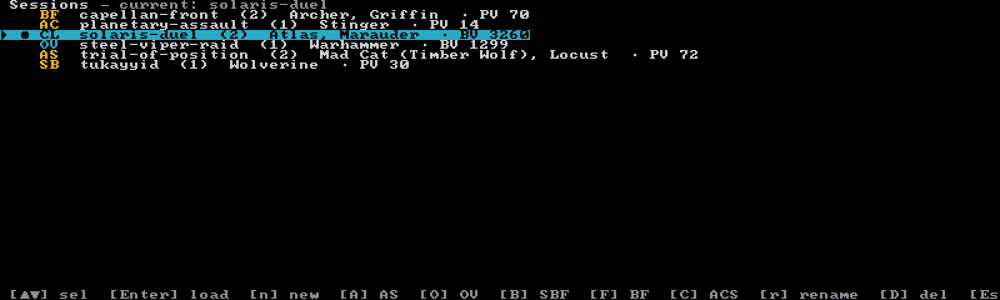

# Your first session

Ten minutes, one 'Mech, one full turn. This walkthrough uses **Classic** (Total Warfare) mode —
the paper-doll tracker — because it's the system a fresh install starts in. Everything you learn
here (the picker, autosave, sessions, undo) carries over to the other five systems.

If you haven't installed Neurohelmet yet, start with [Installation](install.md).

## Launch: you're in the unit picker

Run `neurohelmet` with no arguments. On a fresh install the default Classic session has no units
yet, so the app drops you straight into the **unit picker** — the searchable catalog of all
**9,724** units. (Whenever a session's roster is empty, the picker is where you land; once it has
units, you land on the tracker.)

There's no menu to navigate first. Just start typing.

## Find a unit

Type a name — letters go straight into the fuzzy search box, and the title shows how far you've
narrowed the catalog:

- **Type** to search (fuzzy, case-insensitive), **`Backspace`** to delete.
- **`↑`**/**`↓`** move the selection; **`PgUp`**/**`PgDn`** jump a page.
- **`Esc`** backs out — from the empty picker at first launch, it offers the Sessions browser.

Note that because letters type into the search, vim-style `j`/`k` don't navigate here — arrows only.

## Preview before you commit

Press **`Tab`** on a highlighted unit to pop open its stat preview:

Movement, points cost in BV and PV, C-bills, armor and structure, chassis quirks, and the full
weapon loadout — everything you'd flip a record sheet for. **`Tab`** or **`Esc`** closes it.

## Add it

Press **`Enter`**. Instead of adding immediately, Neurohelmet opens the **` Add <unit> `** modal:
set **Gunnery** and **Piloting** (defaults 4/5 — **`→`** improves a skill, **`←`** worsens it;
lower is better) and watch the skill-adjusted BV cost update live. **`Enter`** commits, and you're
on the tracker.

Grab three more if you want a full lance — press **`a`** from the tracker to reopen the picker
any time. Classic rosters cap at 12 units.

## The tracker

The paper doll fills the left side — one box per location, each with armor and internal-structure
bars. Down the right: the ` HEAT ` scale, the ` PILOT ` panel, ` MOVE `, and
` WEAPONS / AMMO / EQUIP `. The status line along the bottom shows feedback for every key you
press, plus a short hint strip.

**`Tab`** switches focus between the doll and the equipment list. Arrow keys (or **`h`**/**`j`**/
**`k`**/**`l`**) move the doll cursor between locations, or scroll the weapon list.

## A turn's worth of verbs

Your opponent rolls a hit — here's the bookkeeping. This is a starter set, not the full list
(that's [the Classic page](modes/classic.md)):

| Key | Focus | Action |
|-----|-------|--------|
| **`Space`** | doll | apply 1 point of damage to the cursored location — armor first, then internal, cascading inward when a location is destroyed |
| **`f`** | doll | toggle Front/Rear facing on locations with rear armor |
| **`u`** | doll | repair 1 point (internal first) |
| **`c`** | doll | open the location's critical-slot popup — mark crits, and the tracker applies the consequences |
| **`Space`** | equipment | fire the selected weapon — heat is added and ammo auto-deducted, with a `✓` fired mark |
| **`o`** / **`i`** | — | heat +1 / −1; the ` HEAT ` panel shows the live movement, to-hit, shutdown, and ammo effects |
| **`p`** | — | pilot hit (six boxes, consciousness targets shown) |
| **`e`** | — | end turn for the **active unit**: heat dissipates, fired marks and per-turn tallies clear |
| **`[`** / **`]`** (or **`,`** / **`.`**) | — | previous / next unit in the roster |

You roll; Neurohelmet keeps the sheet. Nothing here rolls dice for you — the app tracks what you
tell it and surfaces the consequences (a PSR indicator when one is due, `** SHUTDOWN **` at heat
30, and so on).

> **Fearless experimentation:** **`z`** undoes your last change — 50 levels deep, in every mode.
> Mash keys freely.

When the turn is done, press **`L`** to snapshot the whole force's state to the session's
[game log](guides/game-log.md) — status reads `Logged Turn N (M mechs)`. It's opt-in and
non-destructive; skip it if you don't care about a replay.

## Help is one key away

**`?`** opens the ` Keys ` reference for the current screen — every mode has its own, and it's the
authoritative in-app reference. Any key closes it. There's also a printable
[cheat-sheet PDF](https://github.com/tympaniplayer/neurohelmet/blob/main/docs/neurohelmet-keybindings.pdf)
in the repo, and the full tables live in [Keybindings](reference/keybindings.md).

While you're exploring: **`Ctrl+T`** opens the display picker — 15 themes, a Pi/Modern layout
toggle, and an icon-set row, all live-previewed. See [Themes & layout](guides/display.md).

## Quitting — and why there's no save key

There isn't one. Neurohelmet **autosaves within a fraction of a second of every change**, so the
sheet on disk is always current. Press **`q`** to quit — it asks `Quit Neurohelmet? (y/n)` first
(**`Ctrl+C`** quits immediately, no questions). Next launch reopens your most recent session
exactly where you left it.

## Named sessions

So far you've been playing in the unnamed `default` session. For a real game night you'll want
named ones — press **`S`** from any play screen to open the **Sessions browser**:

Every session is **locked to one game system at creation** — that's why there are six create keys
instead of one. Each prompts for a name, then an optional force point limit
(blank = none), and drops you into the picker to build the new roster:

| Key | New session |
|-----|-------------|
| **`n`** | Classic (Total Warfare) |
| **`A`** | Alpha Strike |
| **`O`** | Override |
| **`B`** | Strategic BattleForce |
| **`F`** | BattleForce |
| **`C`** | Abstract Combat System |

In the browser, **`↑↓`**/**`kj`** select, **`Enter`** loads, **`r`** renames, **`D`** deletes
(with a confirm — and it refuses to delete the active session), and **`Esc`**/**`q`** goes back.
You can keep as many sessions as you like, side by side; each keeps its own roster, log, and
budget. The full story — on-disk layout, autosave details, backups — is in
[Sessions & autosave](guides/sessions.md).

## Where to go next

- **[Game systems overview](modes/overview.md)** — what the six modes track and how to pick one;
  then the deep dive for your system, e.g. [Classic](modes/classic.md) or
  [Alpha Strike](modes/alpha-strike.md).
- **[Building a force](guides/force-generation.md)** — filters, the availability lens, budgets,
  and the random force generator.
- **[Game log & publishing](guides/game-log.md)** — turn your `L` snapshots into a shareable
  battle report.
