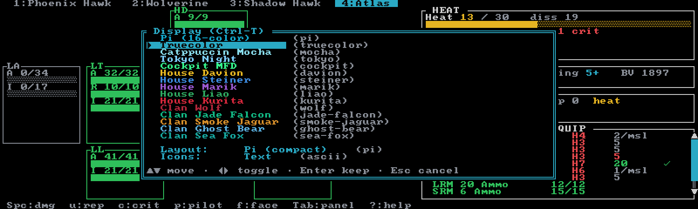
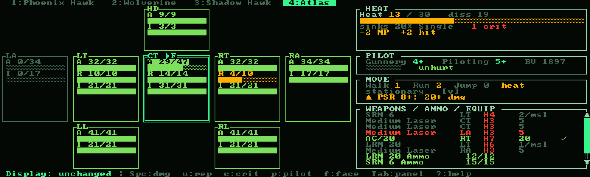
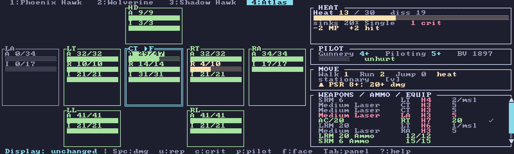
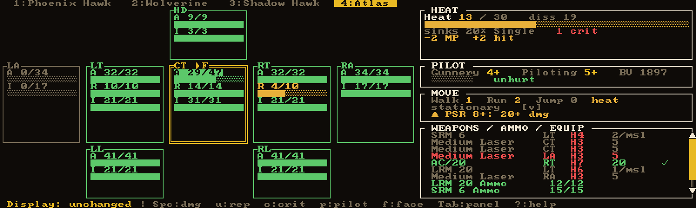
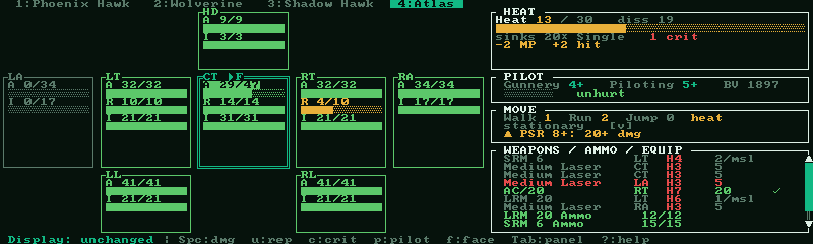
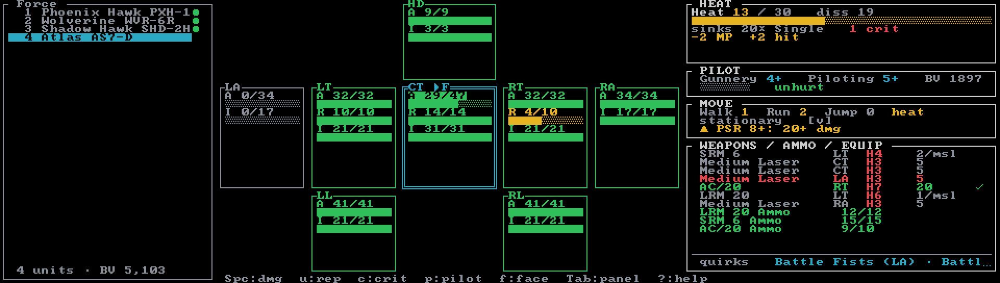
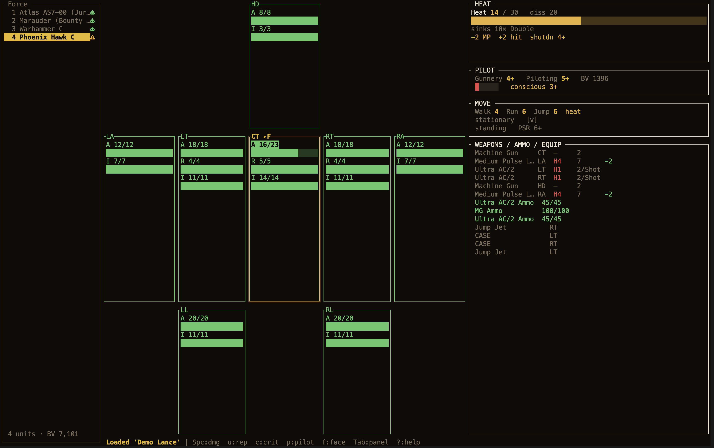

# Themes & layout

Neurohelmet's look is set along three independent axes, all switchable live from one place:

- **Theme** — the color palette. Fifteen presets, from terminal-respecting 16-color to full
  House and Clan liveries.
- **Layout profile** — **Pi** (compact, tuned for a ~100×30 display) or **Modern** (roomier,
  with a persistent Force sidebar where space allows).
- **Icon set** — **Text** (plain characters, works everywhere) or **Nerd Font** (glyph icons,
  if your terminal font has them).

Your choices are saved to [`config.json`](../reference/configuration.md) and restored on the
next launch.

## The display picker (`Ctrl+T`)

Press **`Ctrl+T`** to open the display picker. It works on every screen — the play screens, the
unit picker, the Sessions browser — though not while another modal is open.

Each theme row is *swatched* — drawn in that theme's own accent color — so the list doubles as a
palette preview. Below the themes sit two toggle rows, **Layout** and **Icons**.

| Key | Action |
|-----|--------|
| `↑ ↓` / `k j` | move the selection (wraps around) |
| `← →` / `Space` | toggle Layout or Icons on their rows |
| `Enter` | keep the current state and save it |
| `Esc` | revert everything to how it was when the picker opened |

The preview is **live**: landing on a theme row recolors the entire screen behind the modal
instantly, and toggling Layout or Icons re-flows it, so you see exactly what you're choosing
before you commit. **`Enter`** persists all three axes at once — whichever row you're on — and
the status line confirms with `(saved)`. **`Esc`** rolls all three back and reports
`Display: unchanged`.

## Themes

The full roster, in picker order:

| Config name | Picker label | Look | Paints background? |
|-------------|--------------|------|--------------------|
| `pi` | Pi (16-color) | The original Pi-framebuffer palette: 16 ANSI colors, your terminal's own foreground and background | No |
| `truecolor` | Truecolor | Same semantics as `pi`, but tuned 24-bit hues | No |
| `mocha` | Catppuccin Mocha | Upstream Catppuccin Mocha, so the app blends into a Mocha terminal | Yes |
| `tokyo` | Tokyo Night | Soft slate with muted-but-distinct accents; easy on the eyes for long sessions | Yes |
| `cockpit` | Cockpit MFD | Green-phosphor text on near-black with amber CAUTION and red WARNING tiers, styled like a fighter-jet multi-function display | Yes |
| `davion` | House Davion | Federated Suns: gold sunburst accent, crimson secondary | Yes |
| `steiner` | House Steiner | Lyran Commonwealth: azure "mailed fist" steel blue | Yes |
| `marik` | House Marik | Free Worlds League: royal purple with gold | Yes |
| `liao` | House Liao | Capellan Confederation: green talon, gold secondary | Yes |
| `kurita` | House Kurita | Draconis Combine: crimson dragon on black | Yes |
| `wolf` | Clan Wolf | Deep red on gunmetal | Yes |
| `jade-falcon` | Clan Jade Falcon | Jade green and gold | Yes |
| `smoke-jaguar` | Clan Smoke Jaguar | Amber on charcoal | Yes |
| `ghost-bear` | Clan Ghost Bear | Icy blue and white on deep navy | Yes |
| `sea-fox` | Clan Sea Fox | Teal and aqua (formerly Diamond Shark) | Yes |

"Paints background?" is the practical split: **`pi` and `truecolor` recolor accents while
keeping your terminal's own background and text colors**, so they sit naturally in any terminal
setup. Everything else paints its own full foreground and background for a self-contained look.

The ten faction themes change livery only — all of them share one fixed, readable status ramp,
so a purple Marik card still shows green = healthy, red = destroyed, and the rarity tints in the
unit picker stay consistent too.

Theme names are matched case-insensitively and most have aliases (`catppuccin` → `mocha`,
`fedsuns` → `davion`, `mfd` → `cockpit`, and so on) — handy for the
[`NEUROHELMET_THEME`](#setting-them-without-the-picker) variable. An unknown name is silently
ignored and the next choice in the precedence chain applies.

**The default**, if you've never picked a theme: Neurohelmet checks the `COLORTERM` environment
variable. If it's exactly `truecolor` or `24bit` you get the `truecolor` theme; otherwise `pi`.

### Gallery

The same battle-worn Classic scene in four liveries:

## Layout profiles: Pi vs Modern

The **Pi** profile (the default) is the compact single-pane layout the app was designed around —
everything fits a ~100×30 terminal. **Modern** adds one thing: a persistent **Force sidebar**
down the left edge of the play screens.

The sidebar lists every roster unit — index, name, and a condition glyph (**`●`** ok, **`◐`**
damaged, **`✖`** out of action) — with the active unit highlighted, and a footer totting up the
force: unit count, BV or PV total (colored against the limit if one is set), and the game-log
turn counter. With the sidebar up, the top roster-tabs row is dropped — the sidebar replaces it.

A few things to know:

- The sidebar needs **at least 96 columns** (26 for the sidebar plus 70 for the main panel) and
  a non-empty roster. Below that, Modern gracefully falls back to the single-pane Pi layout —
  per frame, so shrinking the window never breaks anything.
- It appears on the **Classic, Alpha Strike, Override, and BattleForce** play screens. SBF and
  ACS never show it — their formation lists live in their own panes already.
- The profile is an explicit choice, never auto-detected from terminal size. Aliases: `pi` /
  `default` / `compact`, and `modern` / `laptop` / `wide`.

## Icon sets: Text vs Nerd Font

**Text** (the default) uses plain characters everywhere. **Nerd Font** swaps in richer glyphs —
but only if your terminal font actually is a [Nerd Font](https://www.nerdfonts.com/); Neurohelmet
can't detect that from inside a terminal, so it's strictly opt-in. Without the font, Nerd glyphs
render as empty "tofu" boxes — if you see those, toggle back to Text.

What changes today:

- **Force-sidebar condition glyphs** — `●` / `◐` / `✖` become a robot, warning triangle, and
  skull.
- **Unit-type glyphs in the unit picker** — Nerd mode adds a small icon per row ('Mech, vehicle,
  infantry, battle armor, aerospace); Text mode shows nothing extra.

That's the whole surface for now. All glyphs are single-cell in a monospace Nerd Font, so the
box-drawing grid stays aligned.

## Fonts

Neurohelmet draws with box-drawing (`┌─┐╔═╗`), block-shading (`█░▒▓`), and a few symbols
(`● ◐ ✖ ▶ ✓`), so any decent monospace font works — the app can't change your terminal's font,
only work within it. Recommendations:

- **A Nerd Font** — MesloLGS NF, JetBrainsMono Nerd Font, or Iosevka Nerd Font — pairs naturally
  with the Icons = Nerd Font setting.
- **For the `cockpit` theme**, a blocky bitmap font (Terminus, Cozette, Spleen) sells the retro
  CRT-MFD look.

Here's the Modern layout in a real terminal — Nerd Font, hi-DPI, mid-game:

## Setting them without the picker

Each axis has an environment-variable override — useful for scripting, or for trying a look
without committing to it:

| Variable | Values |
|----------|--------|
| `NEUROHELMET_THEME` | a theme's config name (or alias) |
| `NEUROHELMET_PROFILE` | `pi` / `modern` |
| `NEUROHELMET_ICONS` | `ascii` / `nerd` |

Resolution order for each axis is **environment variable → saved config → built-in default**.
An env var wins for that launch only: the `Ctrl+T` picker still works and still saves, but the
variable shadows the saved choice again next time. Unrecognized values at any level simply fall
through to the next. See [Configuration](../reference/configuration.md) for the full config
story.

One aside: headless renders — `--selftest`, [`--export`](game-log.md), and
[`--pdf`](pdf-record-sheets.md) — never load display settings. They always render in the `pi`
theme, Pi layout, Text icons, so exported frames and sheets look the same on every machine.
