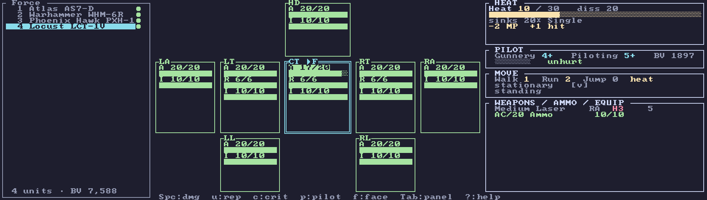

# Themes & layout

Press **`Ctrl-T`** anytime to open the display picker. It previews changes live and remembers your
choice across restarts (saved in [`config.json`](../reference/configuration.md)).

The picker controls three things:

- **Theme** — the color scheme. Several presets are included; the default follows your terminal.
- **Layout profile** — **Pi** (compact, sized for a 7" ~100×30 display) or **Modern** (roomier, with a
  force sidebar where space allows).
- **Icon set** — **ASCII** (works everywhere) or **Nerd Font** (glyph icons, if your terminal font has
  them).

The **Modern** profile adds a Force sidebar listing every unit and the roster's point total:

## Setting them without the picker

Each has an environment-variable override that wins for a single launch, useful for scripting or trying
a look without committing to it:

| Variable | Values |
|----------|--------|
| `NEUROHELMET_THEME` | a theme's config name |
| `NEUROHELMET_PROFILE` | `pi` / `modern` |
| `NEUROHELMET_ICONS` | `ascii` / `nerd` |

Resolution order for each is **environment variable → saved config → built-in default**. See
[Configuration](../reference/configuration.md).
