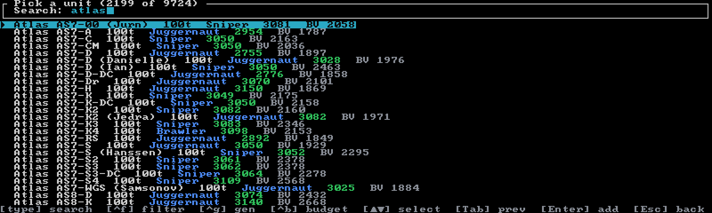
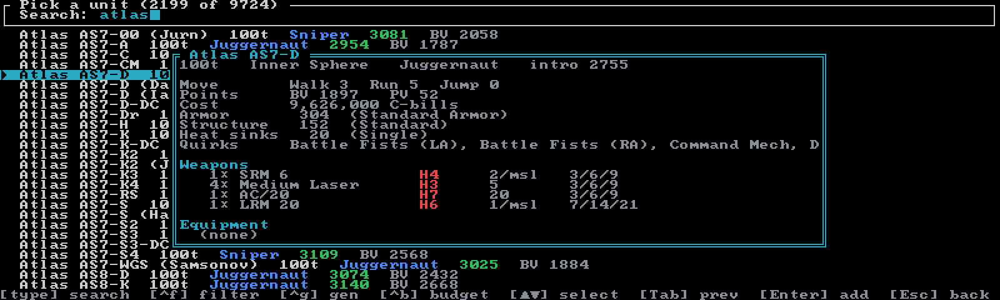
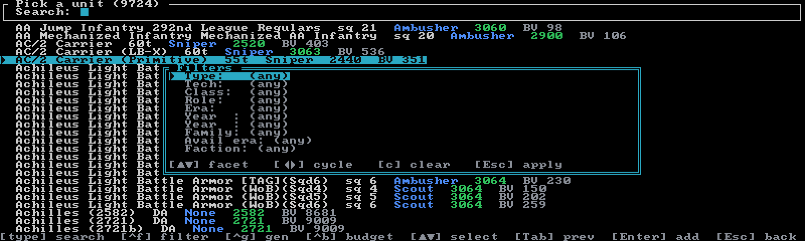
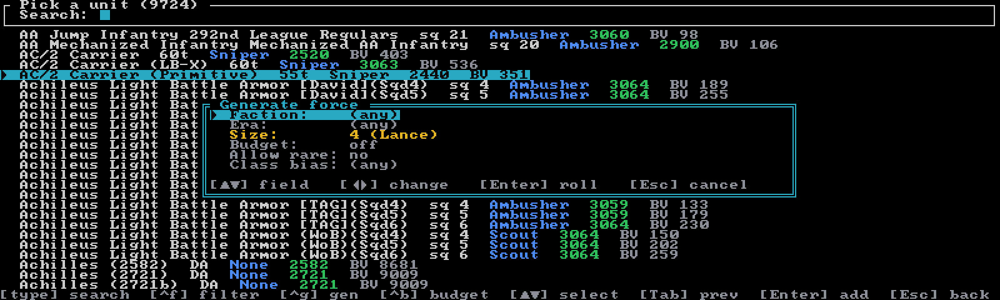

# Building a force

Every unit in your roster enters through the **unit picker** — press **`a`** on any play screen
to open it (a brand-new session with an empty roster starts there). The picker searches the full
**9,724-unit** catalog, and around it sit the tools that turn a pile of units into a force: a
stat preview, faceted filters, a faction/era availability lens, a random force generator, and a
running point budget.

## Searching the catalog

Just type — any printable character goes into the fuzzy, case-insensitive search box, and the
list re-ranks as you go. The title shows how far you've narrowed (`N of 9724`), plus your budget
total and a summary of any active filters. Each row shows chassis and model, tonnage (squad size
for infantry), role, intro year, and BV.

| Key | Action |
|-----|--------|
| type / `Backspace` | edit the search query |
| `↑ ↓` | move the selection (wraps) |
| `PageUp` `PageDown` | jump a page |
| `Tab` | toggle the stat **preview** popup |
| `Enter` | add the selected unit (opens the skill & cost modal) |
| `Ctrl+F` | faceted filters |
| `Ctrl+B` | set the force point limit |
| `Ctrl+G` | generate a random force |
| `Esc` | close the preview, or back to your session (empty roster: offers the Sessions browser) |

Because letters type into the search, `j`/`k` don't navigate here — use the arrows. And the
footer's `[Tab] prev` is short for *preview*, not "previous".

## Previewing a unit

**`Tab`** opens a full stat card for the selected unit: tonnage, tech base, role, and intro year;
movement (Walk/Run/Jump, Cruise/Flank for vehicles, thrust for aerospace); a **Points** line with
BV and PV; a **Cost** line in C-bills; armor and structure with type names; heat sinks and
transport bays where they apply; a **Quirks** line listing the chassis's design quirks; and the
grouped weapons and equipment lists. The same card is repeated inside the add modal, so you never
have to bounce back out to double-check.

## Adding a unit

**`Enter`** doesn't add immediately — it opens an **Add** modal where you set crew skills first.
Classic and Override show two rows with unit-appropriate labels (Gunnery/Piloting,
Gunnery/Driving for vehicles, Gunnery/Anti-Mech for infantry and battle armor); the other systems
use a single **Skill** row. Defaults are Gunnery 4 / Piloting 5. **`→`** improves a skill (lower
is better), **`←`** worsens it, and the cost line re-computes live so you can see what a veteran
crew really costs. `Enter` commits; the status line reports your new total against the limit.

Two guardrails to know:

- **Roster cap** — Classic and Override rosters hold at most **12** units; Alpha Strike, BF,
  SBF, and ACS rosters are uncapped.
- **AS-only units** — a handful of catalog entries exist only as Alpha Strike cards (no record
  sheet). Classic and Override sessions refuse them with a pointer to add them to an AS session
  instead.

## Filters (`Ctrl+F`)

**`Ctrl+F`** opens the filter editor. Ten facets, applied together — a unit must match every one
you set; unset facets read "(any)":

| Facet | Values |
|-------|--------|
| **Type** | Mech · BattleMech · OmniMech · Vehicle · Infantry · Battle Armor · Aerospace |
| **Tech** | tech bases from the data, most common first |
| **Class** | weight classes |
| **Role** | battlefield roles |
| **Era** | eight intro eras, Age of War through ilClan |
| **Year ≥ / Year ≤** | typed intro-year bounds (digits; `←→` nudge ±1) |
| **Family** | the chassis subtype family |
| **Avail era / Faction** | the availability lens — see below |

The Type values are worth a second look: **BattleMech** means true BattleMechs (including
omnis, excluding IndustrialMechs), **OmniMech** narrows to omni chassis only, and plain **Mech**
keeps IndustrialMechs too.

In the modal: `↑↓`/`kj` pick a facet, `←→`/`hl` cycle its value, **`c`** clears everything, and
`Esc` or `Enter` applies and closes. Every change re-filters the list live. On the **Faction**
row, `Enter` opens a type-to-search combo box over the 82-faction catalog. Your active filters
appear as a summary chip in the picker title — e.g.
`Mech · Clan · Heavy · @ Draconis Combine in Clan Invasion`.

## The availability lens

The last two facets — **Avail era** and **Faction** — are *soft*: they never hide anything.
Instead they tint each row's name by how available that unit is to the chosen faction in the
chosen era, and (when the search box is empty) sort the list most-available-first. Tiers run
Very Common → Common → Uncommon → Rare → Very Rare → Not Available, with Unknown for units that
have no availability data at all.

Note the distinction: **Era** filters by *intro year*; **Avail era** picks the point in history
at which availability is judged. Set either half of the lens on its own and the other axis takes
its best case.

## Generating a force (`Ctrl+G`)

When you'd rather roll a period-appropriate force than hand-pick it, **`Ctrl+G`** opens the
generator. It draws **'Mechs only** (mixed forces are a planned later phase), weighted by
availability for your chosen faction and era — common designs show up often, rare ones rarely.

| Field | What it does |
|-------|--------------|
| **Faction / Era** | who's fielding the force, and when — pre-filled from the availability lens if you set one |
| **Size** | 1–12 units; named formations are labelled as you cycle (4 Lance, 5 Star, 6 Level II, 12 Company) |
| **Budget** | on/off — caps the roll at the session's point limit (defaults on if a limit is set) |
| **Allow rare** | includes off-table and no-data units at minimal weight — but never units introduced after the era |
| **Class bias** | Light/Medium/Heavy/Assault — quadruples that class's draw weight without excluding others |

`↑↓`/`kj` pick a field, `←→`/`Space` change it, and **`Enter`** (or **`r`**) rolls. The result
stage lists the drawn units — tinted by rarity — with a cost summary. **`Enter`** accepts and
appends them to your roster at default skills (one `z` undo step takes them all back), **`r`**
rerolls, **`Backspace`** returns to the settings, `Esc` cancels.

A few honest mechanics: size is a *target* but the budget is a *ceiling* — the roll stops short
rather than bust the limit, and tells you so. Duplicates are allowed, just like a real garrison.
Rolls are seeded, so a reroll steps deterministically rather than reshuffling chaos. Each roll
caps at 12 units even in uncapped modes — roll and accept repeatedly to build bigger. And the
generator *appends* to whatever you've already built; it never replaces your hand-picked units.

## Force point budgets

Set a point limit and Neurohelmet tracks your spend everywhere — the picker title, the add
modal, the Sessions browser, and the Modern layout's Force sidebar all show
`total/limit`. Bust it and the picker title flags **OVER**, the add modal warns **OVER by N**
in red, and the sidebar's limit turns red. The limit never blocks an add; it informs you.

- **Classic / Override** budget in **BV** (Battle Value).
- **Alpha Strike / BF / SBF / ACS** budget in **PV** (Point Value). In SBF the total is the
  summed Alpha Strike PV of the elements — a deliberate proxy, not the derived SBF formation PV.

Every new session prompts for a limit as you create it (blank = none). After that, press **`b`**
on the Classic, Alpha Strike, SBF, or BF screen — or **`Ctrl+B`** in the picker — to change it.
The Override and ACS screens have no budget key: set the limit at creation or from the picker.

## Skills & re-costing

Costs are always **skill-adjusted**: a Gunnery 2 ace costs more BV than the stock 4/5 crew, and
the force total recomputes the moment a skill changes. To edit skills after adding a unit:

| Mode | How |
|------|-----|
| Classic, Alpha Strike, Override | **`g`** opens the Pilot skills modal |
| BattleForce | **`s`** (in BF, `g` is the group editor) |
| SBF | inside the **`g`** group editor — `s`/`S` adjust the selected element's skill |
| ACS | no in-session skill editor — set skills in the Add modal when picking units |

In the skills modal, `↑↓`/`kj` pick the row and `←→` adjust — lower is better, clamped 0–8.

---

Once the force is assembled, it lives in a [session](sessions.md) that autosaves on every
change — see the [mode pages](../modes/overview.md) for how each system plays it.
