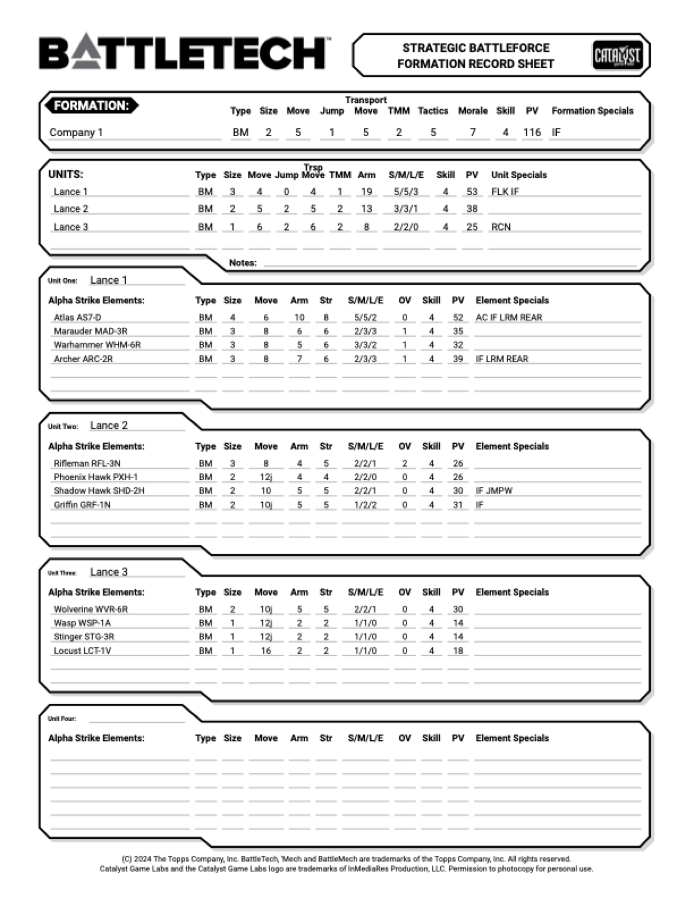

# PDF record sheets

Neurohelmet can export a session's force as **print-ready, always-blank PDF record sheets** — US
Letter pages you can print and take to the table, in the classic MegaMek/Mekbay sheet style. The
sheets are generated entirely by Neurohelmet's own vector-drawing code and converted to PDF
locally, so exporting works fully offline.

## Which modes have sheets

PDF export covers the three BattleForce-family systems:

| System | Sheet |
|---|---|
| [BattleForce](../modes/battleforce.md) | one Unit record sheet per BF Unit |
| [Strategic BattleForce](../modes/strategic-battleforce.md) | one formation record sheet per formation |
| [Abstract Combat System](../modes/abstract-combat-system.md) | one sheet per Combat Unit, plus a force-wide Formation Tracking sheet |

**Classic, Alpha Strike, and Override sessions can't export sheets** — trying prints
`PDF export supports BattleForce, Strategic BattleForce, and ACS sessions only`. For those modes
the shareable artifact is the [game log](game-log.md) instead. The reverse holds for ACS: it has
no game log, so the record sheet *is* its printable output.

## Always blank — by design

The exported sheet is a pristine fill-in form every time. Static roster data — names, stats,
force organization, skills, PV, and COM/LEAD designations (those are pre-game roles, not damage) —
is printed; every live counter is stripped first: armor and structure hits, heat, criticals,
fatigue, morale, rounds. It doesn't matter how battered your on-screen force is.

The rationale: a printout exists to take a *clean* sheet to the table. There is no
"current-state" variant and no flag to request one.

## Exporting from the app — `P`

On the BattleForce, SBF, or ACS screen, press **`P`** (uppercase — it's case-sensitive) to
**export record-sheet PDF**. No dialog, no confirmation — the file is written immediately to your
sessions directory as `<session-name>-sheets.pdf`, and the status line confirms:

```text
Wrote PDF record sheet → /home/you/.local/share/neurohelmet/sessions/my-game-sheets.pdf
```

The export uses your current in-memory roster — unsaved edits included — with counters blanked as
above. See [Sessions & autosave](sessions.md) for where the sessions directory lives on your
platform.

> **`P` is only a PDF key on these three screens.** On the Classic tracker and the Override
> screen, `p`/`P` are the pilot-hit and heal-pilot keys.

## Exporting from the command line — `--pdf`

```sh
neurohelmet --pdf <session> [outfile]
```

`<session>` is a saved session name (as shown in the Sessions browser). The optional second
argument is an output **file** path — not a directory — and its parent directories are created if
missing. Without it, the PDF lands in the same default spot as the in-app export:
`<sessions-dir>/<session-name>-sheets.pdf`. On success:

```text
Wrote record sheet for 'my-game' → /home/you/.local/share/neurohelmet/sessions/my-game-sheets.pdf
```

An unknown name errors with `No saved session '<name>'.`, and a BF or ACS session with nothing in
it errors with `session has no formations/units to export`. (A fresh SBF session still renders one
mostly-blank page — its default empty formation counts.) See the
[command-line reference](../reference/cli.md) for the other verbs.

## What's on each sheet

All three layouts share the same scaffold: BattleTech logo top-left, Catalyst Game Labs logo
top-right, and the standard Topps/CGL record-sheet notice ("Permission to photocopy for personal
use") along the bottom — exactly as MegaMek prints it. Long names and specials auto-shrink to fit
their columns.

### Strategic BattleForce — Formation Record Sheet

One page per formation, a faithful port of MegaMek's SBF sheet. Each page carries:

- a **FORMATION** header — name, type, size, move, jump, transport move, TMM, tactics, morale,
  skill, PV, and formation specials;
- a **UNITS** summary block for up to four Units — type, size, movement, TMM, Arm, S/M/L/E damage,
  skill, PV, specials (COM/LEAD show up here), and a notes line;
- **Unit One–Four** sub-blocks, each listing up to six Alpha Strike elements with their full stat
  rows.

SBF armor is printed as a **numeric value, not pips** — that's how the official Interstellar
Operations sheet does it. Empty slots still get blank underline rows, so a half-filled formation
prints as a usable hand-fill form.

Here is page 1 of a sample export — this exact file came from the `tukayyid` sample SBF session:



Download the actual PDF: [sbf-record-sheet.pdf](../images/sbf-record-sheet.pdf).

### BattleForce — Unit Record Sheet

One page per BF Unit, up to **six element cards** per page — a bigger Unit paginates onto a
"(cont.)" page automatically. Each element card has:

- stat cells — Type, Size, MV in hexes, TMM (aerospace elements print a **TH** threshold
  instead), OV, Skill, PV — plus a **DESTROYED** checkbox;
- the damage brackets `S (+0) M (+2) L (+4) E (+6)`;
- **blank armor and structure pip rows** — empty circles to strike off as you take hits;
- a four-box heat track (`1 2 3 S`) and a specials line.

Elements you never grouped into a Unit aren't lost: they print on a final **Unassigned** page.
Empty Units print nothing.

### Abstract Combat System — two sheet types

Every Combat Unit gets a **Combat Unit Record Sheet**: its stat grid (type, size, move, TMM,
armor, S/M/L/E, tactics, morale, skill, PV), specials, **morale-check armor thresholds** at
75%/50%/25%, a Combat Teams summary, and blank tracking aids — a fatigue (FP) line, morale
checkboxes, and Force Commander (COM) / Formation Leader (LEAD) checkboxes.

The export then appends one **Formation Tracking Sheet** for the whole force: a round/Force-PV/
Leadership line and a grid of formation boxes, each summarizing a formation's stats and its Combat
Units with ARM, PV, and `[COM LEAD]` tags.

## Limits worth knowing

The sheets trim rather than overflow in a few places:

| Mode | Cap |
|---|---|
| SBF | 4 Units per formation page, 6 elements per Unit block — extras aren't printed (SBF's own rules cap a formation at 4 Units, so in practice this never bites) |
| BF | 6 element cards per page — but BF is the only mode that paginates, adding "(cont.)" pages instead of trimming |
| ACS | 8 Combat-Team rows per Combat Unit sheet; 4 Combat Units listed per formation box; **14 formations** on the tracking sheet — extras are silently dropped |

Large craft get no dedicated layout: a DropShip or WarShip in a BF Unit prints as a standard
element card — one damage line, a **TH** threshold cell — without the per-arc CAP/SCAP/MSL table
its on-screen card shows.

## Fonts, logos, and offline use

Text is real embedded **Roboto** (the same face Mekbay uses, Apache-2.0 licensed), subsetted into
the PDF — selectable and searchable, not outlines. The BattleTech and Catalyst logos come from
MegaMek's CC-BY-NC-SA asset set. Everything is baked into the binary: no network access, no
external converter, no official CGL sheet PDFs bundled — the layouts are Neurohelmet's own
drawings with the official sheets as a visual reference. See
[License & attribution](../reference/attribution.md) for the full notices.
