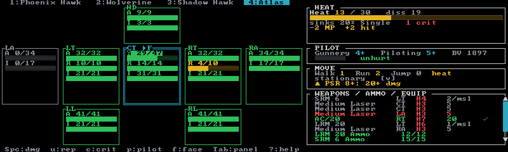

# Introduction

**Neurohelmet** is a keyboard-driven [ratatui](https://ratatui.rs) BattleTech tracker — a terminal
"paper doll" for running a game from a single screen. It's sized for a 7" Raspberry Pi display
(~100×30 cells) but is at home in any terminal, and it is **fully offline**: the entire
9,724-unit catalog is baked into the binary, so the app never touches the network at runtime.

You roll the dice and mark the results; Neurohelmet keeps the sheet and surfaces the
consequences — armor cascade, heat effects, crit fallout, to-hit math.

## Six game systems

Every system is a first-class mode with live state — damage, heat, ammo, criticals, pilots,
morale, fatigue. A session is locked to one system when you create it, so a Classic lance and a
Strategic BattleForce battalion sit side by side in the [Sessions browser](guides/sessions.md),
each autosaved as you play.

| System | Scale | In brief |
| --- | --- | --- |
| [Classic](modes/classic.md) | one record sheet per unit | The full Total Warfare sheet: armor/structure doll, heat, ammo, criticals, pilot — for 'Mechs, vehicles, infantry, Battle Armor, and aerospace. |
| [Alpha Strike](modes/alpha-strike.md) | one card per unit | Card play: armor and structure pips, S/M/L/E damage bands, a heat dial, and crit tracking. |
| [Override](modes/override.md) | one card per unit | Death From Above Wargaming's fast-play system — region cards with 2d6 hit numbers, weapon TICs, and a 0–5 heat ladder. |
| [BattleForce](modes/battleforce.md) | lances of element cards | Per-element cards grouped into lance-scale Units, with BattleForce crits, morale, and rounds. |
| [Strategic BattleForce](modes/strategic-battleforce.md) | formations of Units | Units of 1–6 elements fused into formation-scale stats — company play on one screen. |
| [Abstract Combat System](modes/abstract-combat-system.md) | formations of Combat Units | The biggest scale: armor pools and damage thresholds, fatigue, morale — ground and aerospace. |

Not sure which fits your table? Start with the [game systems overview](modes/overview.md).

## Manual first

Neurohelmet is a *tracker*, not a rules engine that plays the game for you. You stay in charge of
every roll and every result. Where the app helps, it helps deliberately: it does the bookkeeping
and offers reference tables, but it never rolls for you or hides a decision. Automation — like
doctrine-based auto-grouping or the random force generator — is opt-in and warns before it would
discard something you entered by hand.

## Highlights

- **Find and build a force** — a fuzzy-search picker over the whole catalog, with faceted
  filters, a faction/era availability lens, and a random force generator, all under a BV or PV
  budget. See [Building a force](guides/force-generation.md).
- **A game log you can share** — press **`L`** to snapshot the turn, then export the frames or
  publish them as a browsable image gallery. See [Game log & publishing](guides/game-log.md).
- **Print-ready PDF record sheets** — blank fill-in sheets for BattleForce, Strategic
  BattleForce, and ACS, generated straight from your session. See
  [PDF record sheets](guides/pdf-record-sheets.md).
- **Make it yours** — 15 themes, Pi and Modern layouts, and Nerd Font icons, live-previewed
  with **`Ctrl+T`**. See [Themes & layout](guides/display.md).

## What's in these docs

- **Getting started** — [Installation](install.md), [your first session](first-session.md), and
  [running on a Raspberry Pi](raspberry-pi.md).
- **[Game systems](modes/overview.md)** — the six modes compared, plus a deep page on each.
- **Guides** — [sessions & autosave](guides/sessions.md),
  [building a force](guides/force-generation.md),
  [the game log](guides/game-log.md), [PDF record sheets](guides/pdf-record-sheets.md), and
  [themes & layout](guides/display.md).
- **Reference** — [keybindings](reference/keybindings.md), the
  [command line](reference/cli.md), [configuration](reference/configuration.md),
  [data & re-baking](reference/data.md), [troubleshooting](reference/troubleshooting.md), and
  [license & attribution](reference/attribution.md).

## Unofficial & non-commercial

Neurohelmet is an unofficial, non-commercial, fan-made tool, not affiliated with or endorsed by
Microsoft, Topps, Catalyst Game Labs, Death From Above Wargaming, or the MegaMek project. See
[License & attribution](reference/attribution.md) for the full picture.

## Where to start

[Install it](install.md), then take the ten-minute
[first session walkthrough](first-session.md) — you'll have a 'Mech on screen and a turn logged
before your coffee cools.
