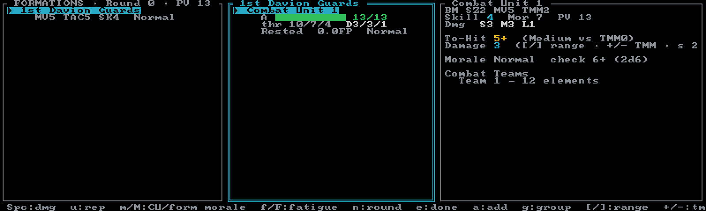

# Abstract Combat System

The **Abstract Combat System** (ACS) from *Interstellar Operations: BattleForce* is the top rung of
the BattleForce ladder — the planetary-invasion, multi-regiment scale where whole battalions fuse
into a single stat line. Create an ACS session from the [Sessions browser](../guides/sessions.md)
with **`C`**.

ACS tracks **your side only**. There is no opposing-force roster — your opponent's numbers (like
the target TMM) are set by hand at combat time, and Neurohelmet never rolls dice: the to-hit,
damage, and morale panels are readouts over your own 2D6. You roll; Neurohelmet keeps the sheet.

## The hierarchy

Elements fuse upward through four tiers:

- **Elements** — individual units from the picker — combine into **SBF Units** (up to 6 elements).
- SBF Units combine into **Combat Teams** (up to 4 Units).
- Combat Teams combine into **Combat Units** — **the tracked atom** at this scale. Each Combat
  Unit is one armor pool with its own fatigue and morale.
- Combat Units group into **Formations**, which activate together each round.

Combat Teams are a derivation detail — the detail pane lists them so you can see how the numbers
were built, but they carry no live state. Everything above the element is recomputed on the fly
from your pool, so regrouping is always safe: derived stats follow the structure.

A new ACS session starts with one empty Formation named "Formation 1". The roster is **uncapped**
(the 12-unit limit applies to Classic and Override only), and elements are costed in
skill-adjusted Alpha Strike **PV**. There is no budget key on the ACS screen itself — set an
optional force limit with **`Ctrl+B`** inside the [picker](../guides/force-generation.md). Note
that the budget compares element PV, while the FORMATIONS pane title shows the *derived* ACS
force PV — a deliberately different (much smaller) number.

## The screen

Three panes, plus a status bar with key hints along the bottom:

- **Left — FORMATIONS.** Title shows the current round and total force PV. Each Formation lists
  its name, a **`COM`** badge if it holds the Force Commander, a **`✓`** when it has activated
  this round, and a derived stat line: `MV` (movement), `TAC` (tactics), `SK` (skill), plus its
  morale rung. If any pool elements are ungrouped, a warning counts them below the list.
- **Middle — Combat Units** of the active Formation. Each shows its name (with **`COM`** /
  **`LEAD`** badges), an armor bar with remaining/max, its three damage thresholds (`thr`),
  damage bands (`D S/M/L`), fatigue band with FP count, and morale rung.
- **Right — detail pane** for the active Combat Unit: type, size, movement, TMM, skill, morale,
  PV, damage bands, then the live **to-hit and damage readout**, the **morale-check readout**,
  and the Combat Teams fold.

Cycle Formations with **`←`**/**`h`**/**`,`** and **`→`**/**`.`**; cycle Combat Units with
**`↑`**/**`↓`** or **`k`**/**`j`**.

## Grouping — the `g` editor

Press **`g`** to open the **Group force** editor. Each pool element shows its skill and its
current home (`Formation · Combat Unit · SBF Unit`, or "unassigned" if it hasn't been placed).

| Key | Effect |
|---|---|
| **`↑`**/**`k`**, **`↓`**/**`j`** | select a pool element |
| **`←`** / **`→`** / **`Space`** | move the element between existing SBF Unit slots |
| **`n`** | split into a new SBF Unit in the current Team |
| **`t`** | new Combat Team in the current Combat Unit |
| **`c`** | new Combat Unit in the current Formation |
| **`F`** | new Formation |
| **`u`** | unassign the element |
| **`a`** | auto-group the whole pool |
| **`Esc`** / **`Enter`** / **`g`** | close (empty tiers are pruned) |

**`a`** auto-group builds one Formation over the entire pool with default nesting (Units of ≤4
elements, Teams of ≤4 Units, Combat Units of ≤3 Teams). Because it rebuilds *everything*, it asks
first whenever you'd lose something you entered by hand — the prompt itemizes exactly what
(your grouping, custom names, armor hits, fatigue, morale rungs, COM/LEAD marks). On a pristine
grouping there's nothing at stake, so it just runs. Either way it's a single **`z`** to undo.

Back on the main screen, **`r`** renames the active Formation and **`D`** deletes it —
immediately, with no confirmation. The elements survive in the ungrouped pool, and **`z`** brings
the Formation back if you slip.

## Armor pools and damage thresholds

A Combat Unit is a single armor pool — no structure bar, no crit table, no per-element state.
What matters is the three **damage thresholds**, derived at the 75/50/25% armor marks.

To apply damage, press **`Space`** (or **`Enter`**) and type the amount — ACS takes a typed
number, unlike SBF's point-at-a-time entry, because at this scale hits land in double digits.
Damage clamps to remaining armor and never spills over to another Combat Unit; at 0 armor the
unit is **destroyed**. When a hit crosses one or more thresholds, the status line tells you —
`Armor 12/31 — 1 threshold(s) crossed → morale check ([M])` — but it's a prompt to roll, not an
automatic result: you roll the check and set the rung yourself. **`u`** repairs 1 point per
press.

## Fatigue

Each Combat Unit carries **Fatigue Points** (FP, half-points are legal):

- **`f`** — *fought this turn*: adds FP rated by the unit's experience (green troops tire
  faster).
- **`F`** — *rest*: −1 FP.

Nothing accrues automatically — fatigue is per-unit and manual, like everything else here. The FP
total maps to a band (**Rested → Tired → Flagging → Exhausted → Spent**, with elite units
shrugging off the first few points), shown in the middle pane. The band's combat and damage
penalties feed the to-hit, damage, and morale readouts automatically.

## Morale

ACS uses **seven rungs**: Normal, Shaken, Unsteady, Broken, Retreating, Routed, Surrender.

- **`m`** cycles the active Combat Unit's rung, one step worse per press (wrapping back to
  Normal).
- **`M`** cycles the active Formation's rung.

The detail pane shows the morale-check target — `Morale Shaken  check 9+ (2d6)` — built from the
unit's Morale Value, experience, fatigue, and whether it has crossed its third threshold. Roll,
then set the result with **`m`**. Rung effects (a shaken unit shoots worse, a broken one deals
less damage) flow into the calculators on their own.

## The combat readout

The right pane computes to-hit and damage for the active Combat Unit as attacker:

- **`[`** / **`]`** — cycle range: Short / Medium / Long (aerospace Formations add **Extreme**).
- **`+`** / **`-`** — set the target's TMM (−4 to +9).
- **`s`** — toggle secondary target.

Attacker-side terms — experience, own morale, fatigue — fill in automatically from the live unit.
The readout covers the common modifiers; situational ones (tactics, from-behind, no-supply,
artillery) you apply mentally, the way you would at the table. The computed damage is advisory:
Neurohelmet never applies it anywhere — read it out, and your opponent takes it on their sheet.

## Aerospace Formations

ACS covers aerospace, not just ground. A Formation that derives as aerospace carries an `aero` tag
in the FORMATIONS pane and switches the detail pane to the **aero readout** — its own to-hit table
with the four-step range ladder (Short through **Extreme** on **`[`**/**`]`**), plus extra
shot-editor keys:

| Key | Effect |
|---|---|
| **`w`** | cycle capital weapon class |
| **`v`** | cycle firing arc |
| **`x`** | cycle the cross-type matchup (fighters vs DropShips vs WarShips) |
| **`L`** | toggle "target is a large craft" (waives the weapon-class penalty) |
| **`y`** | cycle the Ground-Support mission |

Large craft bring their per-arc capital damage with them from the bake — pick the arc and weapon
class and the damage line follows. **`y`** cycles through the five Ground-Support mission
readouts — CAP, Ground Strike, Aerial Recon, Orbit-to-Surface bombardment, and Combat Drop —
and back to plain space combat; each mission shows its numbers inline (strike target numbers,
bomb clusters, drop results).

## Rounds and leadership

- **`e`** marks the active Formation done for the round (the **`✓`** in the left pane).
- **`n`** begins the next round: the round counter bumps and every done-mark clears. Armor,
  fatigue, and morale all persist — they *are* the record sheet.
- **`C`** names the active Combat Unit **Force Commander** (`COM`, one per force).
- **`l`** names it **Formation Leader** (`LEAD`, one per Formation).

Nothing else happens at the round boundary — no automatic fatigue, no morale recovery, no damage
resolution. Manual first.

## No game log — print the sheets instead

ACS is the one mode without the [game log](../guides/game-log.md) — there is no `L` snapshot
here (in ACS, `L` is the aero large-craft toggle). Its printable artifact is the **PDF record
sheet**: press **`P`** (or run `neurohelmet --pdf <session>`) to export blank, print-ready
sheets — one Combat Unit Record Sheet per Combat Unit plus a Formation Tracking Sheet for the
force. See [PDF record sheets](../guides/pdf-record-sheets.md).

## ACS keys

| Key | Effect |
|---|---|
| **`Space`** / **`Enter`** | apply damage to the active Combat Unit (typed amount) |
| **`u`** | repair 1 armor |
| **`f`** / **`F`** | fatigue: fought this turn / rest (−1 FP) |
| **`m`** / **`M`** | cycle Combat Unit / Formation morale |
| **`n`** | begin next round |
| **`e`** | toggle the active Formation done |
| **`C`** / **`l`** | set Force Commander / Formation Leader |
| **`g`** | grouping editor |
| **`r`** | rename the active Formation |
| **`D`** | delete the active Formation (elements return to the pool) |
| **`[`** / **`]`** | readout range (Short/Medium/Long, + Extreme for aero) |
| **`+`** / **`-`** | target TMM |
| **`s`** | toggle secondary target |
| **`w`** **`v`** **`x`** **`L`** **`y`** | aero shot editor (aerospace Formations only) |
| **`←`**/**`h`**/**`,`** , **`→`**/**`.`** | previous / next Formation |
| **`↑`**/**`k`** , **`↓`**/**`j`** | previous / next Combat Unit |
| **`a`** | add elements (opens the picker) |
| **`z`** | undo (50 deep) |
| **`P`** | export PDF record sheets |
| **`S`** | Sessions browser |
| **`?`** | help |
| **`q`** | quit |

Press **`?`** in the app for the authoritative key reference, or print the
[cheat-sheet PDF](https://github.com/tympaniplayer/neurohelmet/blob/main/docs/neurohelmet-keybindings.pdf).
The full cross-mode table lives in the [keybindings reference](../reference/keybindings.md).
