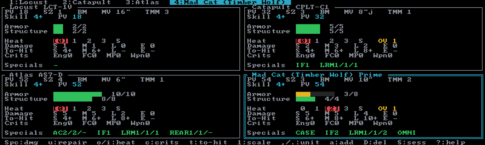

# Alpha Strike

The fast-play card game — one Alpha Strike card per unit, four to a screen. You roll; Neurohelmet
keeps the cards. Create an Alpha Strike session with **`A`** from the
[Sessions browser](../guides/sessions.md), then add units with **`a`**. Alpha Strike rosters are
**uncapped** — build a lance or a company — and the force is costed in **PV** (Point Value)
against any [point budget](../guides/force-generation.md) you set.

## The card screen

The screen is a grid of cards, one per unit:

- In the default **Pi** layout profile the grid is a fixed **2×2 — four cards per page**.
- In the **Modern** profile the grid grows to fit your terminal, up to a **4×4 sixteen-card
  company** on one page. Modern also adds the ` Force ` sidebar on wide terminals — every unit
  with a condition glyph (`●` ok, `◐` damaged, `✖` destroyed) and a running
  `N units · PV total/limit` footer.
- The **active** unit's card gets a bold double border in the accent color; a destroyed unit's
  border turns red. With more than one page, the footer shows `page X/Y ·` and the view follows
  the active unit.

Cycle units with **`,`**/**`.`** (or **`[`**/**`]`**); **`<`**/**`>`** jump four units at a
time — one full card row. Switch layout and theme any time with **`Ctrl+T`**
(see [Themes & layout](../guides/display.md)).

## Anatomy of a card

Top to bottom, each card shows:

1. **Stat line** — `PV`, `SZ` (size; `-` for size-0 gun emplacements), the type code, `MV`, and
   `TMM`. Aerospace units add `TH`, the damage threshold that triggers a crit roll — shown for
   reference, not automated.
2. **Skill line** — `Skill N+` and the **skill-adjusted PV** this unit actually costs (see
   [Skills and PV](#skills-and-pv) below).
3. **Status banner** — `*** DESTROYED ***` or `*** SHUTDOWN (heat) ***` when either applies.
4. **Armor and Structure** — pip rows: `█` remaining (colored by how much is left), `░` lost,
   plus a `remaining/max` count.
5. **Heat** — a dial of boxes ` 0  1  2  3  S ` with the current level highlighted. The last box
   is **S** for Shutdown. Units with an Overheat value show `OV n` beside the dial.
6. **Damage** — the card's `S M L E` values, exactly as printed (`0*` means minimal damage; a
   flat `0` is dimmed).
7. **To-Hit** — live target numbers per range bracket, updated by skill, heat, crits, and the
   shot context (below). Brackets with no damage show `—`. The row disappears while the unit is
   destroyed or shut down — there is no shot to make.
8. **Crits** — running counters, e.g. `Eng0  FC0  MP0  Wpn0`; any non-zero count turns red.
9. **Shot** — the current shot context, e.g. `atk jump   tgt TMM2 jumped`, when one is set.
10. **Specials** — the card's special-ability tokens, verbatim (`AC2/2/-`, `IF1`, `CASE`,
    `TUR(...)`, …), kept visible while you play.

## Damage, repair, and heat

The core verbs are one key each:

- **`Space`** (or **`Enter`**) applies **1 point of damage** — armor first, then structure.
  The status line answers with the new `Armor N / Struct N`.
- **`u`** repairs 1 point in exact reverse — structure first, then armor.
- **`o`** / **`i`** move the heat dial up / down.

A unit is **destroyed** when its structure reaches 0 — or, for 'Mechs only, at 2 Engine
crits. Destruction is a display state: the card turns red and the To-Hit row hides, but nothing
is removed from your roster, and **`u`** can bring a unit back if the table rules it so.

At heat **S** the unit is **shut down**: the banner appears and the To-Hit row hides. It is
recoverable — cool back down with **`i`**. Heat is entirely manual in this mode; nothing raises
or dissipates it for you (see [No end turn](#no-end-turn-in-alpha-strike)).

## Critical hits

**`c`** opens the ` Alpha Strike crits ` popup. Select a type with **`↑`**/**`↓`** (or
**`k`**/**`j`**), add a hit with **`Space`**/**`→`**/**`Enter`**, remove one with **`←`**, close
with **`Esc`** or **`c`**. The set of crit types offered matches the unit type:

| Unit type | Crit types | Notes |
|---|---|---|
| 'Mechs, infantry (default) | Engine, Fire Control, MP, Weapon | Engine caps at 2 — the second kills a 'Mech |
| Aerospace | Engine, Fire Control, Weapon | No MP — engine crits halve thrust instead |
| Combat vehicles | Engine, Fire Control, Weapon, Motive | Motive is the 5-box track: 1–2 = −2″ MV, 3–4 = ½ MV, 5 = immobile |
| Gun emplacements | Weapon only | Already immobile |

Two effects are wired in for you: each **Fire Control** hit adds +2 to every to-hit number, and
a 'Mech's second **Engine** hit marks it destroyed. The rest — MP, Weapon, Motive — are
bookkeeping counters shown red on the card; you apply their movement and damage consequences at
the table. The card's MV and Damage rows always show the printed stats.

## The to-hit helper

The **To-Hit** row always shows a full 2d6 target number per bracket:

> Skill + range (S +0 / M +2 / L +4 / E +6) + heat level + 2 per Fire Control crit
> \+ attacker movement + target modifier, floored at 2.

Press **`t`** to open the ` To-hit target ` shot editor and set the context: **Attacker
jumped** (+2 — jumping is the only attacker move Alpha Strike penalises), **Target TMM**
(0–6), **Target jumped** (+1), and **Target immobile** (a flat −4 that overrides the target
terms). Move between rows with **`↑`**/**`↓`**, adjust with **`←`**/**`→`**/**`Space`**, and
close with **`Esc`**, **`t`**, or **`Enter`**. A live `To-Hit` preview updates as you edit.

The target here is hand-entered, not another unit on your roster — it is a calculator, not a
targeting system. Stepping TMM below 0 clears the target entirely. With no shot context set,
the row shows the attacker-side number alone. The context — jumped flag and target — persists
until you change it.

## No end turn in Alpha Strike

There is deliberately no **`e`** end-turn key on this screen. Heat, the shot context, crits —
everything persists until you change it, because Alpha Strike turns don't carry the bookkeeping
cadence Classic's do. The turn marker is **`L`**: it appends a snapshot of every card to the
session's [game log](../guides/game-log.md) as `Turn N` — opt-in, non-destructive, and it
imposes no turn structure of its own.

## Skills and PV

**`g`** opens the ` Pilot skills ` editor — in Alpha Strike a single row, `Skill N+`, adjusted
with **`←`**/**`→`** (0–8, default 4, lower is better). The card's Skill line then shows the
**skill-adjusted PV**: skill 4 costs the printed PV; better pilots cost more and worse pilots
less, on the official Alpha Strike scaling (bigger base PV, bigger steps), never below 1.

Your force total is the sum of skill-adjusted PV across the roster. **`b`** sets a **force PV
limit** (blank clears it); the total shows against the limit and turns red when you're over.
The unit picker's pre-add popup shows the same math — `Cost PV n (base m)` plus the resulting
force total — before you commit. See [Building a force](../guides/force-generation.md).

## Ground (hex) scale

Standard Alpha Strike is played in inches; press **`1`** to toggle the per-session **1:1 ground
scale** for play on hex maps. Every distance halves, rounded up (2″ = 1 hex):

- Each card's **MV** converts per movement mode — `8"` → `4`, `10"/8"j` → `5/4j`, `5"t` → `3t`.
  Aerospace thrust passes through unchanged.
- The footer becomes a hex range reference: `Rng S 0-3  M 4-12  L 13-21  E 22-30`
  (inches: S ≤6″, M ≤24″, L ≤42″, E ≤60″).

Nothing else changes — damage, TMM, to-hit, and PV are scale-independent. It's a display
preference, saved with the session.

## Alpha Strike keys

| Key | Action |
|---|---|
| `Space` / `Enter` | 1 damage (armor then structure) |
| `u` | repair 1 |
| `o` / `i` | heat up / down |
| `c` | critical hits |
| `t` | to-hit shot (attacker move + target TMM) |
| `L` | log snapshot (game log) |
| `g` | edit pilot Skill |
| `b` | set force point limit (PV) |
| `1` | toggle 1:1 ground (hex) scale |
| `,` / `.` | previous / next unit (`[` / `]` also) |
| `<` / `>` | jump 4 units (one card row) |
| `a` | add a unit (picker) |
| `D` | delete the active unit (confirms) |
| `S` | Sessions browser |
| `z` | undo (up to 50 steps) |
| `Ctrl+T` | display picker (theme, layout, icons) |
| `q` | quit (confirms) |

Keys are case-sensitive. The in-app **`?`** modal is the authoritative key reference for this
screen, and the printable cheat sheet ships in the repo as `docs/neurohelmet-keybindings.pdf`.
The full cross-mode reference is [Keybindings](../reference/keybindings.md).

Looking for more per-unit detail at card speed? [Override](override.md) tracks a heavier card —
regional damage, weapon groups, a six-step heat ladder — for rosters up to twelve units.
