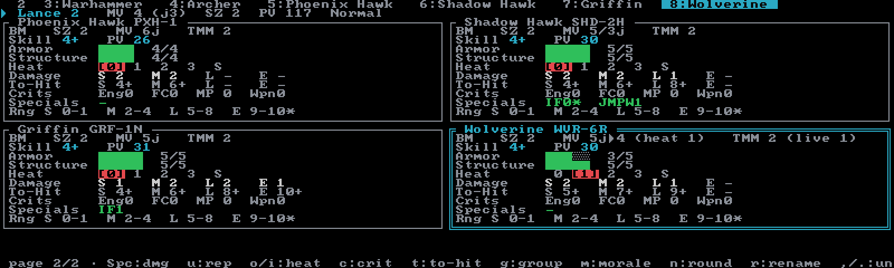
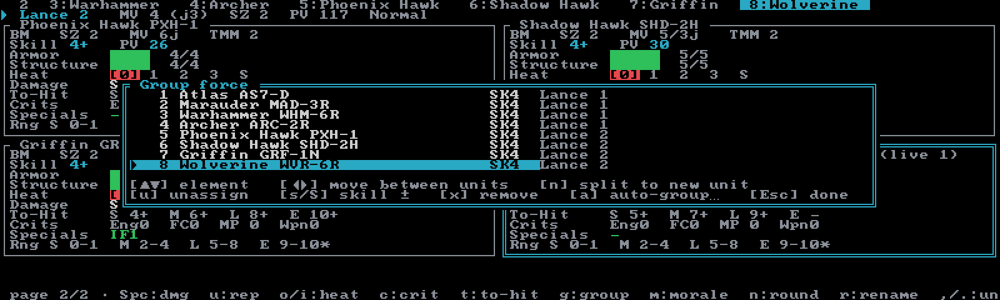

# BattleForce

Standard **BattleForce** from *Interstellar Operations: BattleForce* — every element tracked on its
own Alpha Strike card at hex scale, grouped into lance-**Units** with their own movement, morale,
and point totals. Create a BattleForce session with **`F`** from the
[Sessions browser](../guides/sessions.md).

There is no converter step: the element data *is* the baked Alpha Strike card, shared with
[Alpha Strike](alpha-strike.md) mode. Only movement converts — AS inches ÷ 2 = hexes (aerospace
thrust passes through unchanged). The tracker holds **your** force; the opponent's numbers are
hand-entered in the to-hit editor. You roll every 2D6 yourself — Neurohelmet keeps the sheet.

## How it differs from Alpha Strike

Same cards, different table rules. Where BattleForce diverges, this mode follows *IO:BF* — Alpha
Strike mode is untouched:

- **Hex-native ranges** (1 hex = 90 m): ground brackets are S 0–1, M 2–4, L 5–8, E 9–10\* — printed
  on every ground card's footer — not the AS inch bands. Aerospace uses S 0–32 / M 33–64 /
  L 65–107 / E 108–133. MV displays in hexes.
- **Attacker standstill −1** to-hit (Alpha Strike has no such modifier).
- **No to-hit floor** — Alpha Strike floors the TN at 2; BattleForce does not.
- **Ground Extreme damage = Long − 1** (minimum 0), derived at attack time. The baked E value is
  aerospace-only data.
- **A type-columned critical table** (Engine / Fire Control / MP / Weapon counters, motive rungs,
  crew results) instead of Alpha Strike's four crit types.
- **Lance-Unit grouping** with derived Unit MV, Size, and PV — Alpha Strike has no grouping tier.
- **Per-Unit morale** and a **round counter** — neither exists in Alpha Strike.

Everything else — card stats, armor/structure pips, the `0 1 2 3 S` heat dial, the skill-PV table,
damage and repair verbs — is the Alpha Strike you already know.

## How it differs from Strategic BattleForce

[Strategic BattleForce](strategic-battleforce.md) fuses elements upward into formation-scale sheets
with aggregate stats; standard BattleForce never does. Each element keeps its own armor, structure,
heat, and crits, and the Unit tier only derives movement, size, PV, and morale from its members.
BF has one grouping tier (Unit) where SBF has two (Formation → Unit), a three-rung morale ladder
where SBF uses four, and none of SBF's capital-scale subsystems (no capital bracket-reduction, no
8/6/4 attack cap).

## The screen

Elements render as Alpha Strike-style cards under **Unit header rows**, paged vertically so the
active card stays in view. On a wide terminal (Modern layout) a **Force** sidebar lists the roster
with condition glyphs and the force PV total — red if you're over the **`b`**-set budget; narrow
terminals get a roster tab strip instead. The roster is **uncapped** — add as many elements as the
scenario calls for.

A Unit header looks like `▸ Fire Lance   MV 3 (j3)  SZ 2  PV 187  Broken`:

- **MV** is live — the lowest current MP among surviving members; `(jN)` appears only when *all*
  surviving members can jump.
- **SZ** is stamped at grouping time (the round-normal mean of member sizes) and only restamps on
  membership edits — element destruction doesn't change it.
- **PV** is the sum of the members' skill-adjusted PVs.
- The **morale rung** (Normal / Broken / Routed) ends the header, color-coded.
- A bold **CANNOT MOVE (shutdown)** badge pins the Unit while any surviving member is
  heat-shutdown.

Each card shows type/size/MV (with live-degradation reasons like `heat 2` or `crit`), live TMM
(aerospace shows a `TH` threshold instead), skill and skill-adjusted PV, armor and structure pips,
the heat ladder with OV rating, current S/M/L/E damage (post-crit; `0*` is the minimal-damage
band), a live **To-Hit** row, a **Crits** row in the BF vocabulary (`Eng` `FC` `MP−` `Wpn`
counters plus flags like `STUN` and `MOT½`), specials, and the hex range footer. Large craft print
per-arc damage lines instead and omit the heat row — they don't overheat at BF scale.

## Grouping your force

New sessions start with one empty Unit. Ungrouped elements are legal — single-element Units are
first-class in BF — and collect under an implicit **Unassigned** section. Unit capacity is
advisory; Neurohelmet never blocks an under- or oversized lance.

Press **`g`** for the **Group force** editor:

| Key | Effect |
|---|---|
| `↑`/`k`, `↓`/`j` | select an element |
| `←` / `→` / `Space` | cycle the element through Units (in sheet order) |
| `n` | split into a new Unit |
| `u` | unassign |
| `s` / `S` | element Skill +1 / −1 (re-costs PV and drives to-hit) |
| `x` | remove the element from the force |
| `a` | doctrine auto-group… |
| `Esc` / `Enter` / `g` | done — Units the edit emptied are pruned |

**`a`** opens the doctrine picker: **Inner Sphere** (Lances of 4, Air Lances of 2), **Clan**
(Stars of 5, aero Points of 2), or **ComStar** (Level IIs of 6, Air Lances of 2). Auto-grouping
rebuilds every Unit and warns first when hand-entered names, morale rungs, or notes would be lost —
element damage, heat, and crits stay on the cards, aerospace never mixes with ground, and **`z`**
undoes the whole thing.

## Tracking the fight

The core verbs work on the active element (cycle with **`,`**/**`.`** or **`[`**/**`]`**;
**`<`**/**`>`** jump a full card row):

- **`Space`** (or **`Enter`**) deals 1 damage, armor first then structure. When structure is hit,
  the status line adds **⚠ crit check (2D6, c)** — the roll is yours.
- **`u`** repairs 1, structure first.
- **`o`** / **`i`** dial heat up / down on the `0 1 2 3 S` ladder. Heat subtracts from MP directly, and
  cooldown is **manual** — starting a new round does not cool anyone.
- **`s`** opens the pilot-skills modal (a single Skill row in BF — note that **`g`** is the group
  editor here, unlike the card modes where it edits skills).
- **`D`** deletes the active element, after a confirm.

Undo (**`z`**) is 50 steps deep, and **`L`** logs a turn snapshot — the
[game log](../guides/game-log.md) records the BF grouping, so published frames re-render the whole
sheet.

## Criticals

**`c`** opens the **BattleForce criticals** modal: your element's column of the crit table as a
pick list. You roll 2D6 at the table, apply any defender modifiers the modal surfaces (CR −2,
IRA +1, RFA +2; ≤1 is No Crit, ≥13 is Engine Hit), then pick the row — each applied row is one
undo step.

Columns by unit type: **'Mech**, **ProtoMech**, **Vehicle** (14 rows — the three once-per-game
motive rungs stack: −1 MV, ½ MV, Immobilized), **Aerospace**, **DropShip**, and **JumpShip**.
IndustrialMechs roll **twice** and apply both. Infantry and Battle Armor never take crits —
**`c`** tells you so instead of opening. Gun emplacements use a weapons-only vocabulary; any other
rolled effect becomes +1 damage instead. Elements with **ARM** ignore their first crit chance —
**`a`** in the modal marks it spent.

Effects apply live and are permanent (per the rules) with one exception — **Crew Stunned** clears
at the next round. Highlights: Engine hits stack toward destruction ('Mechs and vehicles die on
the second; aerospace instead drops to TP 0 and shuts down), Fire Control adds +2 to-hit each,
MP hits halve *current* MP at apply time, Weapon hits shave 1 from every damage value, and ammo
hits respect CASE / CASE II / ENE / CASEP. Large-craft rows (KF Boom, Docking Collar, Thruster,
Door, Crew Hit ladders…) are tracked as counters with the consequences resolved at the table.

## To-hit and attack kinds

**`t`** opens the **BF to-hit** editor — the to-hit modifiers table as editable rows with a live
TN and damage preview. Base TN is the attacker's Skill; you hit on 2D6 ≥ TN, with no floor.

The **attack kind** row cycles only what the element can legally declare: Standard, Indirect (IF),
Rear weapons (REAR), the physicals (standard, melee, charge, DFA, anti-'Mech), and the
air-to-ground kinds (altitude bombing, dive bombing, strafing, striking). The preview adapts —
IF damage is never OV-boosted, charge and DFA show the self-damage, bombing shows per-hex damage —
and an **OV commit** row is bounded live by min(card OV, 4 − heat). Rows that don't apply render
dim, and impossible picks (DFA against airborne aerospace, say) fall back to Standard with a note.

Everything in the editor is ephemeral UI state — nothing is saved and nothing needs undoing. While
a hand-entered context is active, the card's To-Hit row is starred (`To-Hit*`). For large craft
the editor grows Firing-arc and Weapon-class rows and previews per-arc TNs.

## Morale and rounds

Both are deliberately manual bookkeeping:

- **`m`** cycles the active Unit's morale rung: Normal → Broken → Routed → Normal. Neurohelmet
  does not simulate morale checks or recovery — the *IO:BF* check tables stay at the table; the
  sheet just remembers the rung.
- **`n`** begins a new round: the round counter bumps and every element's Crew Stunned flag
  clears. Nothing else changes — heat, damage, and crits stay exactly where you put them.

## Record sheets

**`P`** exports a print-ready PDF — one page per Unit (up to six element cards each, plus a page
for unassigned elements), always printed blank so you can fill the pips at the table. The same
export is available from the command line as `neurohelmet --pdf <session>`. See
[PDF record sheets](../guides/pdf-record-sheets.md).

## BattleForce keys

The in-app **`?`** modal is the authoritative key reference, and the printable cheat-sheet PDF
(`docs/neurohelmet-keybindings.pdf` in the repo) covers every mode. Keys are case-sensitive.

| Key | Effect |
|---|---|
| `Space` / `Enter` | 1 damage to the active element (armor, then structure) |
| `u` | repair 1 (structure first) |
| `o` / `i` | heat +1 / −1 (manual dial; cooldown is manual too) |
| `c` | BattleForce criticals modal |
| `t` | to-hit shot editor |
| `g` | grouping editor |
| `m` | cycle the active Unit's morale rung |
| `n` | new round (clears crew-stunned) |
| `r` | rename the active Unit |
| `s` | pilot-skills modal (Skill row) |
| `b` | set the force PV limit |
| `[` / `,` | previous element |
| `]` / `.` | next element |
| `<` / `>` | jump 4 elements (one card row) |
| `a` | add an element (opens the [unit picker](../guides/force-generation.md)) |
| `D` | delete the active element (confirms) |
| `L` | log a turn snapshot |
| `P` | export the PDF record sheets |
| `S` | Sessions browser |
| `z` | undo (50 deep) |
| `?` | help |
| `Ctrl+T` | display picker (theme, layout, icons) |
| `q` | quit (confirms) |
| `Ctrl+C` | quit immediately |
