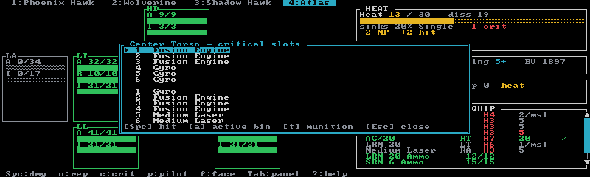
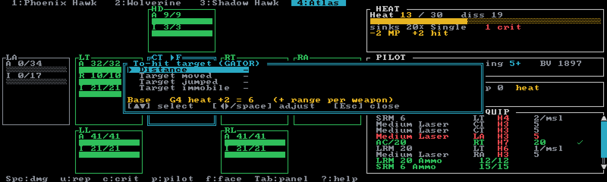
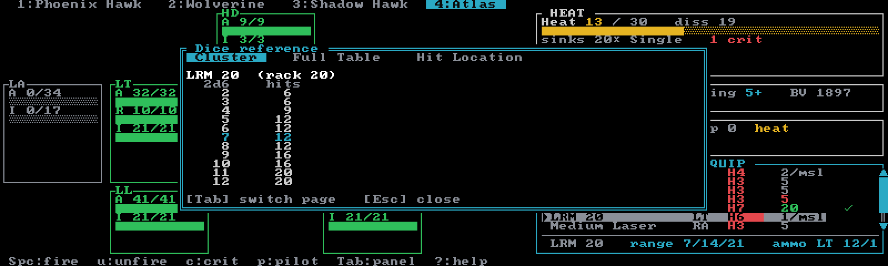
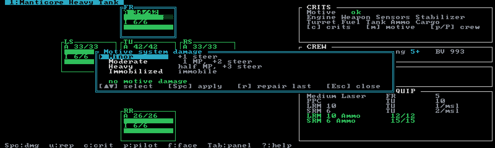
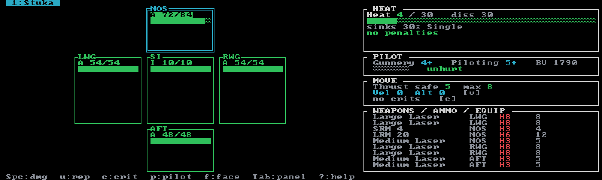

# Classic

The full Total Warfare record sheet, live in your terminal. A Classic session tracks each unit the way
the paper sheet does — armor bubbles, heat scale, critical slots, ammo bins, pilot boxes — and shows
you what every result means as it lands. You roll; Neurohelmet keeps the sheet.

Create a Classic session with **`n`** in the [Sessions browser](../guides/sessions.md), then add
units with **`a`**. A Classic roster holds up to **12 units**, costed in **BV** (set a budget with
**`b`**, or leave it open).

## The screen

- **Roster tabs** across the top — one tab per unit; cycle with **`,`**/**`.`** (or `[`/`]`,
  `Shift+Tab` for previous). On wide terminals with the Modern layout, a force sidebar replaces the
  tab bar — see [Themes & layout](../guides/display.md).
- **The paper doll** on the left — one box per location, each showing armor (`A`), rear armor (`R`,
  torsos only), and internal structure (`I`) with color-graded bars. A destroyed unit collapses into
  a red `*** DESTROYED ***` banner with the reason.
- **The right column** — the **HEAT**, **PILOT**, and **MOVE** panels, then
  **WEAPONS / AMMO / EQUIP**. Vehicles and infantry swap in their own panels (see
  [Other unit types](#other-unit-types)).
- **The status line** at the bottom — the last action's result plus a context key strip.

**`Tab`** switches focus between the doll and the equipment list. Arrow keys (or **`hjkl`**) move
the doll cursor spatially, or scroll the equipment list. Every state change autosaves — there is no
save key — and **`z`** undoes, 50 steps deep.

## Damage

With the doll focused, **`Space`** (or `Enter`) applies **1 point** of damage to the cursored
location; **`u`** repairs one point back (internal structure first, then armor). **`f`** flips
between Front and Rear facing on locations that have rear armor — the box title shows `▸F` or `▸R`.

Damage resolves the Total Warfare way:

- Armor on the struck facing absorbs first; overflow goes into the location's internal structure.
  Front and rear armor are separate pools sharing one internal pool.
- Excess from a destroyed location **transfers inward**: arms and legs to their side torso, side
  torsos to the center torso. Head and CT are terminal. Transferred damage arrives on the Front
  facing of the next location.
- Losing a side torso also destroys the attached arm, and every crit slot in a destroyed location is
  automatically marked — which is exactly how an XL engine dies with its side torso.

## Heat

The **HEAT** panel shows the 0–30 scale, your dissipation (`diss`), sink count and type, and an
effects readout straight from the heat table: movement penalties from heat 5, to-hit penalties from
8, shutdown-avoid rolls from 14, ammo-explosion rolls from 19 — or a green `no penalties` when
you're clean. Destroyed sink slots cut dissipation (`−N crit`), and engine crits add heat
(`eng +N`).

- **`o`** / **`i`** adjust heat by ±1.
- Heat 30 shuts the unit down automatically; cooling below 14 restarts it. In between, shutdown is
  a die roll you make at the table — record the result with **`x`**.
- Firing a weapon adds its heat immediately; end turn applies dissipation.

Vehicles and infantry have no heat track.

## Weapons, ammo & equipment

The **WEAPONS / AMMO / EQUIP** panel lists weapons, then ammo bins, then other gear. Each weapon row
shows its location, heat, damage, and a to-hit column; the pinned detail line at the bottom spells
out the selected item's range, full to-hit assembly, and which ammo bin it will draw from.

With the equipment list focused:

- **`Space`** fires the selected weapon — a green **`✓`** appears, its heat is added, and one round
  is deducted from a compatible ammo bin automatically (the hand-picked **active bin** first, then
  the first compatible bin with shots left). If every compatible bin is empty you get
  `OUT OF AMMO`. Ultra ACs fire up to 2 shots a turn, Rotary ACs up to 6 (`✓shots/max`), everything
  else once.
- **`u`** un-fires one shot: the mark and its heat come off, but **ammo is not refunded** — adjust
  the bin by hand if you need to.
- On an **ammo row**, `Space` spends a shot manually and `u` refills one.
- **`J`** toggles equipment state: mark or clear a **jam** on an Ultra/Rotary AC, engage
  **MASC / Supercharger** (raising Running MP, with a `MASC↑` note in the MOVE panel), or flip
  **ECM / Stealth** systems on and off.

A weapon destroyed by a crit turns red but stays selectable — damage in BattleTech is simultaneous,
so it can still fire the turn it dies. Jammed weapons show an amber ` JAM` tag and refuse to fire
until cleared.

## Critical slots

**`c`** opens the critical-slot popup for the cursored doll location — the printed slot list, ready
to mark.

- **`↑↓`** select a slot; **`Space`** toggles it destroyed or repaired.
- Ammo slots show their remaining shots and loaded munition. **`a`** makes the selected bin the
  **active bin** its weapons draw from first; **`t`** opens the munition picker to load an alternate
  munition (which also updates the cluster table in the dice reference).

Marked crits apply their effects automatically: engine hits add +5 heat per turn each (destroyed at
3), gyro hits add +3 to PSRs each (destroyed at 2), a hip halves Walking MP (two zero it), leg
actuators cost −1 Walk and +1 PSR each, destroyed heat sinks stop dissipating, a cockpit hit puts
the unit out of action, and a hit on any of a weapon's slots disables the weapon.

## Pilot & crew

The **PILOT** panel shows Gunnery, Piloting, the skill-adjusted BV, and the six-box damage track
with its consciousness target (3+/5+/7+/10+/11+ as hits accumulate — KIA at 6).

- **`p`** marks a pilot hit, **`P`** heals one. On vehicles these track **crew** hits instead
  (5 boxes).
- **`X`** toggles unconscious / awake.
- Each pilot hit adds +1 to every PSR. An unconscious or dead pilot leaves the unit immobile; a
  dead pilot puts it out of action.

**`g`** opens the skills editor — Gunnery and Piloting, 0–8, defaults 4/5, lower is better. Skill
changes re-cost the unit's BV live.

## Movement, TMM & PSRs

The **MOVE** panel shows effective Walk/Run/Jump with every penalty already folded in — heat,
actuator and hip crits, lost legs, engine damage — plus this turn's movement and a stance line.

**`v`** opens the movement modal: set how the unit moved (stationary / walked / ran / jumped) and
how many hexes. The modal previews your own attacker modifier (+1 walk, +2 run, +3 jump) and the
TMM your movement gives enemies (+1 at 3 hexes up to +6 at 25, +1 more for jumping; immobile is a
flat −4). Ground movement clears at end of turn.

When piloting rolls are in play, the stance line surfaces them: a `PSR N+` target assembled from
Piloting plus gyro (+3), hip (+2), leg actuator (+1), and pilot hits (+1 each), with the reason
(`20+ dmg`, `ran w/ gyro/hip dmg`, `jumped w/ leg dmg`). One caveat: the **+1 per full 20 damage
this turn is a house rule** — standard Total Warfare calls for a single unmodified roll at 20+
damage. A biped with a destroyed leg shows `⚠ auto-fall` (no roll to stay up; quads keep standing).
**`d`** toggles prone, which shows the stand-up PSR target.

## To-hit help (GATOR)

**`t`** opens the GATOR target modal — Gunnery, Attacker movement, Target movement, Other, Range.

Set the distance (1–60 hexes), how far the target moved, and whether it jumped or is immobile. The
modal shows the shared base (`G4 ran +2 tgt +1 heat +1 = 8`), and the equipment panel's to-hit
column switches to **assembled per-weapon target numbers** — range bracket (S +0 / M +2 / L +4 /
Extreme +6, out past 2× long range shows `X`), heat, and equipment like a Targeting Computer's −1
all included, floored at 2. The focused weapon's detail line spells the whole assembly out.

Neurohelmet never rolls the dice — it only builds the target number. Known limitation: the
**minimum-range penalty is not applied**; add it yourself for LRMs and PPCs inside minimum range.
The target clears at end of turn.

## Dice reference

**`r`** opens a read-only dice reference — it rolls and changes nothing. Three tabs, cycled with
**`Tab`** (or `←`/`→`, `h`/`l`):

1. **Cluster** — the Cluster Hits column for the selected weapon's rack size, honoring its loaded
   munition.
2. **Full Table** — the whole Cluster Hits Table, rack sizes 2–30 and 40.
3. **Hit Location** — the 2d6 'Mech hit-location table for all four attack directions, with `*`
   marking the natural-2 floating crit. ('Mech table only — no vehicle table yet.)

## Ending the turn

**`e`** ends the turn **for the active unit only**: heat resolves (engine-crit heat added, then
dissipation subtracted), and the per-turn state clears — the damage tally behind the PSR indicator,
this turn's movement, the GATOR target, and all fired `✓` marks.

What does **not** clear: jams, ammo counts, crits, prone, shutdown, pilot hits, MASC/ECM
engagement, and aerospace velocity/altitude. Those persist until you change them.

**`L`** appends a game-log snapshot of the whole force — see
[Game log & publishing](../guides/game-log.md).

## Other unit types

Everything above is the 'Mech flow; the tracker adapts per unit type.

- **Quads and tripods** get the right leg layout on the doll. Quads don't auto-fall on a lost leg;
  each missing quad/tripod leg costs a flat −1 Walk.
- **Combat vehicles** use a Front / sides / Turret / Body / Rear doll (plus Rotor for VTOLs) with
  no damage cascade between locations. The HEAT panel becomes **CRITS** — the eight one-shot
  vehicle crit results, where Fuel Tank and Ammo are catastrophic — and **`c`** marks them.
  **`m`** opens the Motive System Damage popup (Minor / Moderate / Heavy / Immobilized, with
  stacking MP and steering effects); **`M`** quick-repairs the last result. Movement reads
  Cruise/Flank, and `p`/`P` track the five-box crew.

  

- **Conventional infantry** are a single Platoon strength pool — damage removes troopers, not
  speed, and the panel estimates the surviving platoon's damage output.
- **Battle Armor** puts each suit in its own doll cell. The doll cursor picks the **firing suit**;
  each weapon fires once per living suit per turn (`✓fired/living`), and every suit carries its own
  ammo.
- **Aerospace fighters** are fully playable: four armor arcs (NOS/LWG/RWG/AFT) around a central
  **Structural Integrity** pool that all arc overflow feeds — SI gone means destroyed. They use the
  aerospace heat scale (control-roll and pilot-damage thresholds instead of movement loss),
  **`v`** edits Velocity (0–60) and Altitude (0–10) which persist across turns, and **`c`** opens a
  graded crit popup (Avionics, Engine, FCS, Landing Gear, Sensors at ×1–×3, plus per-weapon rows by
  arc). Each engine hit costs 2 Safe Thrust and adds 2 heat per turn.

  

## Quirks

Units with chassis design quirks show them in a dim ` quirks ` footer at the bottom of the
equipment panel (when the panel isn't focused). Quirks are display-only — apply their effects at
the table.

## Key reference

The in-app **`?`** modal is the authoritative key reference, and there's a printable cheat sheet
(`docs/neurohelmet-keybindings.pdf` in the repo). Keys are case-sensitive. See also the full
[keybindings reference](../reference/keybindings.md).

| Key | Action |
|---|---|
| `Space` / `Enter` | damage 1 (doll) · fire weapon / spend ammo (equipment) |
| `u` | repair 1 (doll) · un-fire / refill (equipment) |
| `Tab` | switch focus doll ↔ equipment |
| `↑↓←→` / `hjkl` | move doll cursor / equipment selection |
| `f` | toggle Front/Rear facing |
| `c` | critical-slot popup (crit results for vehicles/aero) |
| `J` | toggle jam · MASC/Supercharger · ECM/Stealth (equipment focus) |
| `o` / `i` | heat +1 / −1 |
| `x` | toggle shutdown |
| `d` | toggle prone |
| `p` / `P` | pilot (or crew) hit / heal |
| `X` | toggle pilot unconscious |
| `g` | pilot-skills editor |
| `v` | movement this turn |
| `t` | GATOR to-hit target |
| `r` | dice reference |
| `m` / `M` | motive damage popup / quick repair (vehicles) |
| `e` | end turn (active unit) |
| `L` | game-log snapshot |
| `,` / `.` (or `[` / `]`) | previous / next unit (`Shift+Tab` = previous) |
| `a` | add unit (opens the [picker](../guides/force-generation.md)) |
| `D` | remove active unit (confirms) |
| `b` | force point limit (BV) |
| `S` | Sessions browser |
| `z` | undo (50 deep) |
| `Ctrl+T` | display picker (theme · layout · icons) |
| `?` | full key reference |
| `q` | quit (confirms) · `Ctrl+C` quits immediately |
