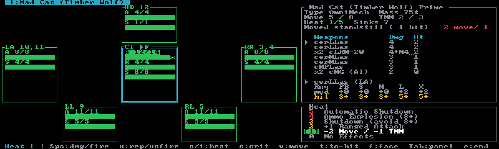

# Override

**BattleTech: Override** is a streamlined fan ruleset by
[Death From Above Wargaming](https://dfawargaming.com) — regions instead of hit locations, a 0–5
heat ladder, and weapons packed into fire groups. Neurohelmet tracks it live, exactly like Classic:
pips, heat, crits, pilot, warnings, end turn.

> **Included with permission from Death From Above Wargaming.** Neurohelmet's Override support is an
> independent, non-commercial implementation of the ruleset. Find out more about BattleTech: Override
> and DFA at **[dfawargaming.com](https://dfawargaming.com)**.

To play, create an Override session: press **`S`** for the [Sessions browser](../guides/sessions.md),
then **`O`** and name it. You'll be offered an optional BV limit (leave it blank for none), then
dropped into the unit picker. Any of the 9,724 catalog units converts to its Override card
automatically the moment you add it — nothing to prepare. (The only refusals are the handful of
Alpha Strike-only entries — emplacements and Battlefield Support with no record sheet — which the
picker turns away with "add it to an AS session".)

## The card

The screen splits into the **armor doll** on the left and the **weapons panel** on the right —
**`Tab`** moves focus between them.

### The region doll

Override collapses the Classic hit locations into a handful of regions. A 'Mech card shows Head,
arms, legs, and **one merged Torso** region (CT, LT, and RT combined). Each box's title carries its
fixed 2d6 hit-location numbers — `HD 12`, `LA 10,11`, `CT 6,7,8`, and so on — so you can read the
doll straight off a hit roll. A `*` prefix means the region has marked crits.

Each box shows `A` (armor), `S` (structure), and — on the merged torso — `R` (rear armor), each
with remaining/max and a bar. Box borders fade from healthy to danger colors as the region wears
down, and go dim once its structure is gone. When a unit is out of action, a **DESTROYED** banner
with the reason (torso, head, pilot, ammo…) replaces the middle of the doll.

### Damage, and the no-transfer rule

With the doll focused, move the cursor with **`↑↓←→`** (or **`kjhl`**) and press **`Space`** to
mark one pip of damage: armor first, then structure. **`u`** repairs one pip in mirror order.
**`f`** flips facing on the merged torso — the box title shows `▸F` or `▸R`, and damage lands on
the matching armor layer. Moving the cursor to a region with no rear armor snaps facing back to
front.

Override's damage model has **no transfer between regions**: once a region is fully depleted,
excess hits on it are simply ignored. Kill the region the dice gave you, or pick a new one.

### The weapons panel

The right panel is the rest of the printed card, top to bottom: **Type** and **Mass**, **Move** and
**TMM**, **Heat n/5** and **Sinks**, the current **Moved** state and its to-hit effect (with any
heat or crit move/TMM penalty beside it in danger color), the TIC table, the selected TIC's range brackets and
live to-hit numbers, **Punch/Kick** values for 'Mechs, the **Equip** ammo line, the pilot/crew
**condition monitor**, a **Crits** summary when any are marked, and warning banners. 'Mechs and
aerospace get the fixed " Heat " ladder block at the bottom.

## TICs — firing and banked heat

Override groups a unit's weapons into **TICs** (fire groups) — at most nine rows, packed
automatically by DFA's own grouping algorithm. The packing is deterministic and read-only: there is
no group editor in Override (**`g`** here is the pilot-skills modal). Each row shows the group's
name, damage string (`7`, `4+M4 (14)`, `2+C5|4|3`…), and heat; rear-mounted weapons are prefixed
`(R)`.

With the weapons panel focused, **`↑↓`**/**`kj`** select a TIC and **`Space`** fires it — a `✓`
appears, the row dims, and the group's printed heat is **banked immediately** onto the ladder.
**`u`** un-fires and refunds the heat. Below the table, the selected TIC's detail shows its
`PB S M L X` range brackets: the printed modifier per bracket (`mod`) and the live computed to-hit
(`hit`), folding in gunnery, your movement, heat, pilot hits, and the shot context.

Press **`t`** for the **To-hit shot** editor: target TMM (0–6), target jumped, target immobile,
secondary target, and rear arc, with a live per-bracket preview. The shot context persists across
end turn — reset the target TMM yourself when you switch targets.

## The heat ladder

Heat runs 0–5. **`o`** and **`i`** nudge it by hand; firing banks it automatically. The ladder
block always shows the effects, current rung highlighted:

| Heat | Effect |
|---|---|
| 5 | Automatic Shutdown |
| 4 | Ammo Explosion (8+) |
| 3 | Shutdown (avoid 8+) |
| 2 | +1 Ranged Attack |
| 1 | -2 Move / -1 TMM |
| 0 | No Effects |

Rungs 3 and 4 are informational — you roll the avoidance; Neurohelmet applies the move and to-hit
penalties for you. At heat 5 the unit is shut down automatically; **`x`** toggles a manual
shutdown/restart at any time.

**`e`** ends the turn for the active unit: heat changes by engine crits minus sinks (a shut-down
unit instead drops to 0), and the fired marks, movement, hexes, and damage-this-turn tally all
clear. Crits, ammo-spent marks, and the shot context survive. A unit's **Sinks** figure is its
Total Warfare dissipation ÷ 5, rounded.

## Movement

**`v`** opens the **Movement this turn** modal: cycle **Moved** through standstill / walked / ran /
jumped and set hexes moved. It shows the implied `own attacks ±N  TMM ±N`, and it clears on end
turn. Your movement feeds the live to-hit (standstill −1, walk/run +0, jump +2).

## Criticals

**`c`** on a cursored region opens the **Override criticals** popup — the region's 2d6 crit table
(roll 2d6, 8+ confirms). Pick a row with **`↑↓`**/**`kj`**, press **`Space`**/**`Enter`** to mark
one more hit of that result (they stack — `Crit ×2`), **`Backspace`**/**`-`** to remove one. The
head has no table; you'll get "HD has no crit table".

Actuator, Motive, and Engine crits apply their effects automatically (−2 move/−1 TMM per
actuator/motive hit; +1 heat per turn per engine hit). Everything else — weapon hits, gyro,
stunned crew, avionics — is summarized on the **Crits** line for you to adjudicate at the table.

**Ammo** is Override-style: no shot counting. Each ammo-bearing region has a live/spent toggle —
press **`a`** inside the crit popup. An Ammo crit on a region with **live** ammo is an explosion:
the unit is destroyed and the pilot takes +2 hits. With spent or no ammo it's a dud. The merged
torso's ammo check covers bins in all three torso locations.

## Pilot, warnings, morale

The condition monitor is the printed track `3+ 5+ 7+ 9+ 11+ KIA` — **`p`** marks a hit, **`P`**
heals one. Each hit adds +1 to every to-hit, PSR, and morale target. Pilots go down at 6 hits,
vehicle crews at 5.

Neurohelmet never rolls for you — it computes targets and warns:

- **`⚠ PSR auto-fail`** when the unit is shut down, the pilot is out, the gyro is destroyed, or a
  leg is gone.
- **`⚠ PSR <N>+`** when a roll is owed — massive damage (10+ pips this phase), TMM reduced, or
  gyro damaged, at +2 per situation.
- **`⚠ Morale <N>+ (crippled)`** when the core region is down to 0 armor and 4 or fewer structure.

## Vehicles and aerospace

**Vehicles** use a Front / Turret / Sides / Rear doll (VTOLs add a **Rotor** box) and have **no
heat track at all** — the ladder, sinks, and Ht column disappear, firing banks nothing, and `o`/`i` report
"No heat track on this unit". Their condition line reads **Crew** (5 boxes to KIA), and their crit
tables lean on Motive and Stunned results.

**Aerospace** fighters keep the heat ladder. The doll becomes four armor-only arcs (Nose, wings,
Aft) around a single shared **SI** structure pool, and the panel shows **Thrust**, **TMM**, and
**DThr** (damage threshold) instead of ground move. All four arcs share one 2d6 crit table; the SI
pool has none. **`v`** edits **Velocity** and **Altitude** instead of ground movement, and those
persist across turns — but the aero attacker's own movement modifier is yours to apply by hand;
the card always computes as if at a standstill.

Conventional infantry and battle armor are **not supported** in Override — they convert to an
empty card with no regions to mark. Leave them for [Classic](classic.md) or
[Alpha Strike](alpha-strike.md) sessions.

## Where the card comes from

The conversion is instant and deterministic: every card is derived on the fly from the same baked
data Classic uses. Base damage is roughly Total Warfare damage ÷ 3, heat ÷ 5, and armor pips divide
TW armor per region; move and TMM come straight from TW movement. Weapons group using DFA's own
packing algorithm and DFA's own per-weapon range modifiers. The converter is a from-scratch port of
DFA's official one, golden-tested against ten real DFA cards — what you see should match what
[dfawargaming.com](https://dfawargaming.com) would print.

## Forces, BV, and sessions

Override forces are costed in skill-adjusted **BV**, like Classic, and share the same **12-unit
roster cap**. Set a BV limit when creating the session or with **`Ctrl+B`** in the
[unit picker](../guides/force-generation.md); there is no budget key on the Override screen itself.
**`g`** edits pilot skills (0–8) and re-costs BV live. Override sessions are tagged **OV** in the
Sessions browser.

**`L`** takes a [game log](../guides/game-log.md) snapshot — Override frames render the region doll
and heat ladder just as you see them. **`z`** undoes the last change (50 deep), and every change
autosaves. PDF record sheets are not available for Override — **`P`** here is pilot heal.

## Keys

The in-app **`?`** modal is the authoritative key reference (its Override page also carries the DFA
credit); there's a printable cheat sheet at `docs/neurohelmet-keybindings.pdf` in the repo. See
also the [full keybindings reference](../reference/keybindings.md).

| Key | Action |
|---|---|
| **`Space`** / **`Enter`** | doll: 1 damage pip to the cursored region · weapons: fire the selected TIC (banks heat) |
| **`u`** | doll: repair 1 pip · weapons: un-fire (refunds heat) |
| **`↑↓←→`** / **`kjhl`** | doll: move the region cursor · weapons: cycle TIC selection |
| **`Tab`** | switch focus between armor doll and weapons panel |
| **`f`** | toggle front/rear facing |
| **`o`** / **`i`** | heat +1 / −1 (0–5) |
| **`x`** | toggle shutdown / restart |
| **`e`** | end turn — dissipate heat, clear fired marks and movement |
| **`c`** | region crit popup (inside: `Space` +hit, `Backspace` −hit, `a` ammo live/spent) |
| **`t`** | to-hit shot editor |
| **`v`** | movement this turn (aero: velocity & altitude) |
| **`g`** | pilot skills (re-costs BV) |
| **`p`** / **`P`** | pilot/crew hit / heal |
| **`z`** | undo (50 deep) |
| **`L`** | log snapshot |
| **`[`** `,` / **`]`** `.` | previous / next unit (**`Shift+Tab`** also goes back) |
| **`a`** | add a unit (opens the picker) |
| **`D`** | remove the active unit (confirms) |
| **`S`** | Sessions browser |
| **`?`** | help — the Override keymap |
| **`q`** | quit (confirms) |

Keys you might reach for from Classic that don't exist here: `b` (budget — use `Ctrl+B` in the
picker), `d` (prone), `r` (dice reference), `m` (motive), and `J` (equipment toggles).
