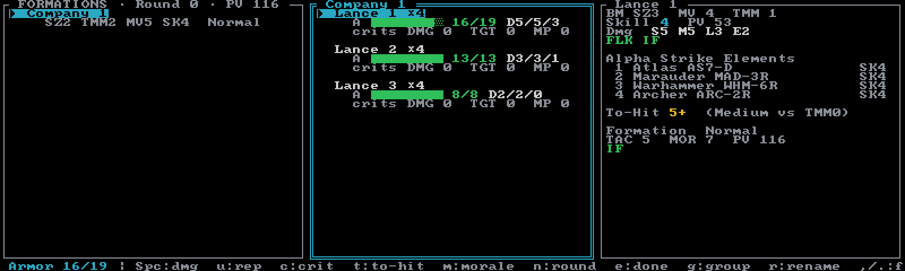

# Strategic BattleForce

**Strategic BattleForce** (SBF) from *Interstellar Operations: BattleForce* — your Alpha Strike
elements fused upward into formation-scale stat lines, so a whole company plays like a handful of
counters. Create an SBF session with **`B`** in the [Sessions browser](../guides/sessions.md).

Where [BattleForce](battleforce.md) keeps every element on its own card, SBF combines them:
**elements** (the same Alpha Strike pool you build in the [unit picker](../guides/force-generation.md))
are grouped into **Units** of 1–6 elements, and Units into **Formations** of 1–4 Units. Neurohelmet
derives the SBF stat line for every Unit and Formation from its elements — you never enter combined
numbers by hand.

SBF is a **single-force tracker**: it tracks *your* formations. The opponent's numbers (target TMM,
jump, terrain) are hand-entered when you work out a shot. And it is manual-first — you roll the dice
and mark the results; the app computes derived stats, to-hit numbers, and warnings, and never rolls
for you.

A new SBF session starts with one empty formation named **Formation 1** and drops you in the picker
to add elements. From there the loop is: **`a`** to add elements, **`g`** to group them, then play.

## The screen

Three panes, plus a one-line footer with the current status and key hints. SBF renders full-frame —
there is no force sidebar here, and the screen is identical in the Pi and Modern
[layout profiles](../guides/display.md).

**Formations** (left) — titled ` FORMATIONS · Round {n} · PV {total} `. Each formation gets two
lines: its name with badges — **COM** (holds the Force Commander), **✓** (done this turn),
**⚠withdraw** (routed or crippled), **!invalid** (breaks an SBF composition rule — a warning, never
a block) — and a dim stat line: `SZ` size, `TMM`, `MV` movement, `SK` skill, plus the morale rung.
If pool elements outnumber grouped ones, a `+{n} ungrouped — [g] to assign` warning appears below
the list.

**Units** (middle) — the active formation's Units, three lines each: the name and element count
with **COM** / **LEAD** badges (or **DESTROYED**, or **⚠crit due** when below half armor); an armor
bar with `{remaining}/{max}` and the current `D{s}/{m}/{l}` damage bands; and a crits line —
`DMG`, `TGT`, and `MP` counters plus current MV (derived movement minus MP crits, floored at 0).

**Detail** (right) — the active Unit in full: type and size, movement (with jump if any), TMM,
`Skill` (derived skill plus targeting crits) and PV, the full pre-crit damage bands
`S/M/L/E`, the Unit's special abilities, and an **Alpha Strike Elements** list showing each
composing element with its pool number and skill. Below that: a live **To-Hit** readout for the
current shot state, and a Formation block — morale, `TAC` tactics, `MOR` morale rating, formation
PV and specials, and a **⚠ CRIPPLED** flag when the formation meets the crippling test.

## Building the force

**`a`** opens the picker to add elements to the pool. **`g`** opens the ` Group force ` editor,
which lists every pool element with its `Formation · Unit` assignment (or `— unassigned`):

| Key | Action |
|---|---|
| `↑` `↓` / `k` `j` | select an element |
| `←` `→` / `Space` | cycle the element through every formation/unit slot (empty formations offer a "new unit here" stop) |
| `n` | split the element into a new Unit |
| `f` | move it into a brand-new formation |
| `u` | unassign it back to the pool |
| `s` / `S` | element skill +1 / −1 — this drives Unit and Formation skill and PV (there is no separate skills modal in SBF) |
| `x` | remove the element from the force entirely |
| `a` | doctrine auto-group |
| `Esc` / `Enter` / `g` | close — element-less Units are pruned; empty formations persist as workspaces |

Every move, skill change, and removal is its own undo step.

**Doctrine auto-grouping** (`a` inside the editor) rebuilds the whole force along real BattleTech
lines: **Inner Sphere** (Lances of 4 → Companies), **Clan** (Stars of 5 → Binary/Trinary), or
**ComStar** (Level IIs of 6 → Level III). Ground and aero elements group separately and are never
mixed — aero forms Flights and Squadrons (Level IIs under ComStar). A pristine grouping applies instantly; if you have
hand-entered anything (custom names, damage, crits, morale, COM/LEAD marks), the app shows an
itemized confirmation of exactly what would be discarded first — and **`z`** undoes it either way.

The **!invalid** badge flags formations that break SBF composition rules (ground: 1–4 Units, ≤20
elements, 1–6 per Unit, size-class limits on large elements; all-aero formations validate as
Squadrons of ≤6 Flights instead). It warns; it never stops you.

## Derived stats

Every Unit and Formation stat line is recomputed on demand from the elements — a faithful port of
MegaMek's SBF converter, locked by golden tests. Roughly: Unit armor is the summed element armor +
structure over 3, damage bands are summed over 3, movement is the halved mean, skill is the mean.
Formation `TAC` derives from movement and skill; `MOR` from skill alone. Only your live marks — damage, crits,
morale, round state — are stored; change an element's skill and everything re-derives.

## Damage & spillover

**`Space`** (or **`Enter`**) marks **1 point of damage** on the active Unit; **`u`** repairs 1.
Armor is a single aggregate pool per Unit — there is no per-element structure at this scale. After
a hit the status line shows the remaining armor, plus a `⚠ crit check (2d6, c)` reminder when the
Unit has dropped below half armor.

A Unit is **destroyed** at 0 armor. Excess damage is never discarded: the status prompts you to
spill the remainder onto another Unit (`j`/`k` to pick one), chaining until it is absorbed — the
placement is your call, as on the tabletop. A formation is **eliminated** when its last Unit is
destroyed; removing it stays up to you.

## Criticals

**`c`** opens the ` SBF criticals ` popup for the active Unit — three manual counters:

- **Damage crits** — −1 damage in every band, each.
- **Targeting crits** — +1 to-hit, each.
- **MP crits** — −1 MP each (0 = immobile); for aero Units the row reads **−1 Thrust each
  (0 = crashes, End Phase)**.

`↑↓`/`kj` select a row, `→`/`Space` adds one, `←`/`Backspace` removes one. The popup's header tells
you whether a crit roll is owed (below half armor), and the 2d6 table is printed right there:
**2–4** none · **5–7** targeting · **8–9** damage · **10–11** both · **12** unit destroyed. You
roll; the popup is where you record the result. (MP crits are a manual mark only — no roll on this
table produces one.)

## To-hit

**`t`** opens the ` SBF to-hit ` editor: a stack of modifier rows you set to match the shot —
range bracket (Short/Medium/Long/Extreme, defaulting to Medium), indirect fire, formation jump
used, units withholding fire, spotting, secondary target, the target's hand-entered TMM/jump/
evade/terrain, aero attack and target kinds, and more. The computed `To-Hit {n}+` updates live in
the editor and stays visible in the detail pane after you close it — each firing Unit rolls
2d6 against it.

Formation special abilities that affect the number (BFC, DRO, SV fire control) are applied
automatically and listed in the editor. Two deliberate choices worth knowing: there is no
natural-2/natural-12 auto-miss/auto-hit rule, and target morale is **not** a to-hit term — the
demoralized-target modifier is left to the table.

The "Formation JUMP used" row is the one piece of shot state that persists (it lives on the
formation and resets each round); everything else is scratch space for the current shot.

## Morale & crippling

**`m`** cycles the active formation one morale rung worse: **Normal → Shaken → Broken → Routed**
(wrapping back to Normal). It is a manual marker — no checks, no target numbers, no automatic
effects, exactly as you would track it on paper.

Separately, Neurohelmet runs the SBF **crippling test** for you: a formation shows **⚠ CRIPPLED**
when half its firepower, armored Units, or fire control is gone. A Routed *or* crippled formation
gets the **⚠withdraw** badge (conventional infantry and Battle Armor formations are exempt) —
whether it actually leaves is your decision.

## Rounds & turns

**`n`** begins a new round: the round counter ticks up, every formation's done-mark clears, and
per-round jump resets. Damage, crits, and morale persist. **`e`** marks the active formation done
this turn — the **✓** badge in the Formations pane. There is no initiative tracking or turn
interleave; a single-force tracker leaves sequencing to the table.

## Aerospace & large craft

Aero formations are first-class citizens. They hide TMM (air-to-air combat uses no movement
modifier), their MP crits are Thrust crits, and a Unit at 0 Thrust shows **CRASHES (End Phase)**
rather than immobile. The to-hit editor's aero rows cover air-to-air, ground-to-air, bombing,
strafing, and striking — with the target-movement suppression and air-to-ground damage math from
the rulebook shown inline.

Large craft (DropShips, JumpShips, stations, WarShips) go further: the firing Unit carries a
per-arc weapon card, and the to-hit editor grows twelve capital-scale rows — firing arc, weapon
class, point defense, screen launchers, and the rest — plus a per-arc damage and attack-limit
summary. The crit popup adds the large-craft Random Weapon Class reference.

## PV & budgets

The Formations pane title shows the force's total **derived SBF PV**; Unit and formation PV appear
in the detail pane. **`b`** sets a force PV limit (blank clears it). One quirk to know: the limit
is checked against the **summed Alpha Strike PV** of your elements — a deliberate budgeting proxy
that differs slightly from the derived SBF PV. Element skill (set in the group editor) re-costs
everything live.

## Record sheets & the game log

**`P`** exports a print-ready, always-blank **PDF record sheet** — one US-Letter page per
formation, in MegaMek's official SBF layout (COM/LEAD designations are kept; live battle state is
deliberately stripped). See [PDF record sheets](../guides/pdf-record-sheets.md) for the full
story and a sample sheet, or use `neurohelmet --pdf <session>` from the command line.

**`L`** appends a [game-log](../guides/game-log.md) snapshot of the whole force — grouping and
live formation state included. `--export` later renders each snapshot as one formation-sheet frame
per formation.

## Keys

The same list lives in-app under **`?`** — that modal is the authoritative quick reference — and on
the printable [cheat sheet](https://github.com/tympaniplayer/neurohelmet/blob/main/docs/neurohelmet-keybindings.pdf).
The full cross-mode table is in the [keybindings reference](../reference/keybindings.md).

| Key | Action |
|---|---|
| `Space` / `Enter` | 1 point of damage to the active Unit (spillover on overflow) |
| `u` | repair 1 armor |
| `c` | criticals popup |
| `t` | to-hit editor |
| `m` | cycle formation morale rung |
| `n` | begin round |
| `e` | mark active formation done this turn |
| `g` | grouping editor |
| `r` / `R` | rename formation / rename Unit |
| `C` | toggle Force Commander (COM) — at most one in the force |
| `l` | toggle Formation Leader (LEAD) — at most one per formation |
| `,` `.` — also `[` `]` and `Tab` / `Shift+Tab` | previous / next formation |
| `↑` `↓` / `k` `j` | previous / next Unit |
| `b` | set force PV limit |
| `a` | add elements (opens the picker) |
| `D` | delete the active formation (confirms; removes its elements too) |
| `L` | game-log snapshot |
| `P` | export PDF record sheet |
| `z` | undo — 50 steps deep |
| `S` | Sessions browser |
| `Ctrl+T` | display picker (theme · layout · icons) |
| `?` | key help |
| `q` | quit |

Unlike the card modes, `h` is not a navigation key here, and there are no heat keys — heat is
already folded into the derived stat lines.
